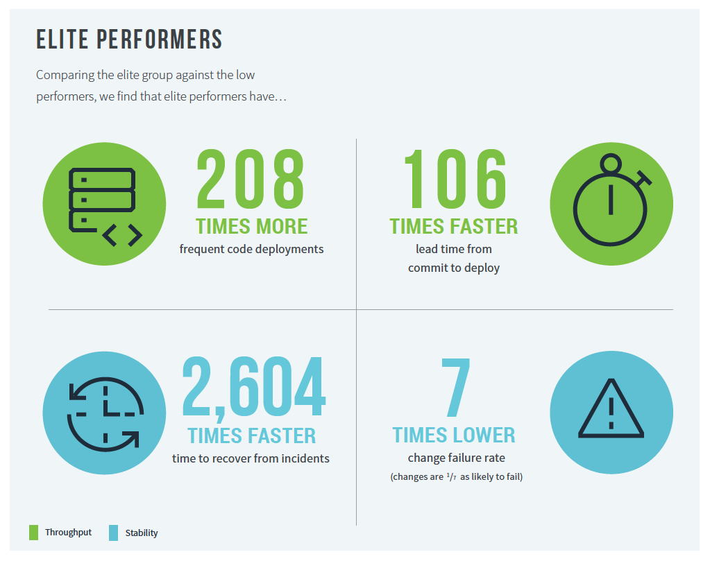

# DevOps Notes

## Software delivery and operational (SDO) performance

* The first 4 metrics that capture the effectiveness of development and delivery process can be summarized in terms of Throughput and Stability
* The Throughput of the software delivery process is measured using Lead Time of code changes from check-in to release along with Deployment Frequency
* Stability is measured using Time-To-Restore (the time it takes from detecting a user-impacting incident to having it remediated)
* Change Fail Rate is a measure of the quality of the release process



* Speed and Stability are outcomes that enable each other
* Availability is important for operational performance
  * Availability represents an ability for technology teams to keep promises and assertions about the software they are operating
  * Availability reflects how well teams define their:
    * Availability targets
    * Track their current availability
    * Learn from any outages, making sure feedback loops are complete




## Throughput

### Deployment Frequency

* By comparison, low performers reported deploying between once per month (12 per year) and once per six months (2 per year)
* The normalized annual deployment numbers range from 1,460 deploys per year for the highest performers to 7 deploys per year for low performers
* CapitalOne reports deploying up to 50 times per day for a product
* Amazon, Google, Netflix report deploying thousands of times per day

### Change Lead Time

* Elite performers report lead times of less than one day
* With lead times of 24 hours for elite performers (estimated at the high end of “less than one day”) and 2,555 hours for low performers (mean of 730 hours per month and 4,380 hours over six months), the elite group has 106 times faster change lead times

## Stability

### Time to Restore Service

* Elite group reported time to restore service of less than one hour, while low performers reported between one week and one month

### Change Failure Rate

* Elite performers reported a change failure rate between 0% and 15%
* Low performers reported change failure rates of 46% to 60%

## Improving SDO and Organizational Performance

### Cloud

* What really matters is how teams implement their cloud services, not just that they are using cloud technology
* 5 essential characteristics of Cloud Computing:
  * 1) On-demand self-service - consumers can automatically provision computing resources as needed, w/out human interaction from cloud provider
  * 2) Broad network access - capabilities can be accessed through heterogenous platforms, such as mobile phones, tablets, laptops, and workstations
  * 3) Resource pooling - cloud resources are pooled in a multi-tenant model, w/physical and virtual resources dynamically assigned on-demand
  * 4) Rapid elasticity - capabilities can be elastically provisioned and released to rapidly scale outward or inward on demand
  * 5) Measured service - cloud systems automatically control, optimize, and report resource use

### Technical Practices

* First off, work to understand the constraints in the current software delivery process with an eye to short- and long-term measurable outcomes
  * By focusing on designing and executing short-term outcomes that support the long-term strategy, teams are able to adjust to emergent and unanticipated problems\
* Continuous Delivery (CD)
  * CD reduces the risk and cost of performing releases
  * CD needs to keep a keen eye on organizational goals such as profitability, productivity, and customer satisfaction
* Team-level technical capabilities
  * Automated testing positively impacts CI
    * The ability to reproduce and fix failures, gather feedback from tests, improve test quality and iterate test runs quickly also ties into test automation
    * Test automation has a significant impact on CD
    * Smart investments in building up automated test suites will help make CI better
    * For CI to be impactful, each code commit should result in successful build of the software and a set of test suites being run
    * Automated builds and automated tests for a project should be run successfully every day
* Organization-level technical capabilities
  * Examples are architecture and/or policies (e.g. change management)
  * There is a positive impact of loosely coupled architecture on CD
    * In loosely coupled architecture, delivery teams can independently test, deploy, and change their systems on demand w/out depending on additional support, services, or approvals
      * This allows teams to quickly deliver value, but it requires orchestration at a higher level
      * Architecture designs that permit testing and deploying services independently help teams achieve higher performance
  * Source control should have short-lived branches, small, readable patches, and automatic testing of changes to make everyone productive
  * Code maintainability positively contributes to successful CD
    * Systems and tools make it easy for developers to change code maintained by other teams, find examples in the codebase, reuse other people’s code, as well as add, upgrade, and migrate to new versions of dependencies w/out breaking their code
    * These systems and tools to maintain code helps decrease technical debt, which in turn increase productivity

### Disaster Recovery Testing

* Any mission-critical software should have a disaster recovery plan
  * Creating plans w/out testing them is like creating backups without also practicing restoring from backup regularly
* Some tests include:
  * Simulations that disrupt production systems (including failure injection such as degrading network links, turning off routers, etc.)
  * Infrastructure (including datacenter) failover
  * Application failover
