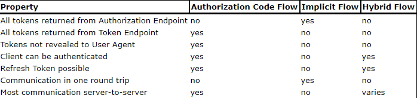
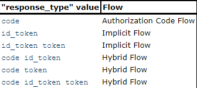

# OpenID Connect (OIDC)

OpenID Connect 1.0, a simple identity layer on top of the [RFC6750 - OAuth 2.0 protocol](https://datatracker.ietf.org/doc/html/rfc6750).

Using OIDC, clients can verify the ID by the authN performed by an authZ server. Used to obtain basic profile information (`Claims`) about end-user in a REST-like manner.

OpenID Connect implements authentication as an extension to the OAuth 2.0 authZ process.

Use of this extension is requested by Clients by including the `openid` scope value in the authZ request.

Info about the authentication performed is returned in JSON Web Token (JWT) called an **ID Token**.

OAuth2.0 AuthN Servers using OIDC are referred to as OpenID Providers (OPs).

OAuth2.0 Clients using OIDC are referred to as Relying Parties (RPs).

The RP needs to get configuration information about the OP, including its `Authorization Endpoint` and `Token Endpoint` locations. This info is normally obtained via Discovery, as described in OpenID Registration 1.0, or may be obtained via other mechanisms.

## Terminology

A complete list of terms can be found here: [OpenID specs - OIDC core 1.0: terminology](https://openid.net/specs/openid-connect-core-1_0.html#Terminology)

## Overview

Abstract steps:

1. The RP (Client) sends a request to the OpenID Provider (OP).
2. The OP authenticates the End-User and obtains authorization.
3. The OP responds with an ID Token and usually an Access Token.
4. The RP can send a request with the Access Token to the UserInfo Endpoint.
5. The UserInfo Endpoint returns Claims about the End-User.


## ID Token

OIDC extends OAuth 2.0 to enable authenticated End-Users to obtain data structure from ID token. The ID Token is a security token that contains Claim about the Authentication of an End-User by an Authorization Server when using a Client, and potentially other requested Claims. The ID Token is represented as a JSON WebToken (JWT).

The following **REQUIRED** Claims are used within the ID Token for all OAuth 2.0 flows used by OpenID Connect:

(There are other optional Claims that can be used, and these can be found here: [OpenID specs - OIDC core 1.0: ID Token Claims](https://openid.net/specs/openid-connect-core-1_0.html#IDToken)

* `iss`: **REQUIRED**. Issuer Identifier for the Issuer of the response. CASE SENSITIVE URL using the `https` scheme containing scheme, host, and optional port number and path components, with no query or fragment components
* `sub`: **REQUIRED**. Subject Identifier. A locally unique and never reassigned ID within the Issuer for the End-User, which is intended to be consumed by the Client. IT MUST NOT exceed 255 ASCII characters in length. CASE SENSITIVE.
* `aud`: **REQUIRED**. Audience(s) intended for the use of ID Token. MUST contain the `client_id` of the Relying Party (RP) as an audience value. It may also contain multiple IDs for other audiences, so value can be either an array of CASE SENSITIVE strings or one single string value.
* `exp`: **REQUIRED**. Expiration time for ID Token. Current date/time MUST be before expiration date/time. Implementers MAY provide some time cushion, no more than a few minutes, to account for a clock skew. Value is a JSON number representing the number of seconds from 1970-01-01T0:0:0Z.
* `iat`: **REQUIRED**. Time at which JWT was issued. Value is a JSON number representing the number of seconds from 1970-01-01T0:0:0Z.

ID Tokens MAY contain other Claims, but any Claims used not understood MUST be ignored.

ID Tokens must be signed using JWS and *optionally* both signed and then encrypted using JWS and JWE respectively, thereby providing authentication, integrity, non-repudiation, and optionally, confidentiality.

If the ID Token is encrypted, it should be signed and then encrypted, with the result being a **Nested JWT**.

ID Tokens MUST NOT use `none` as the `alg` value unless the Response Type used returns no ID Token from the Authorization Endpoint, and the Client explicitly requested the use of `none` at Registration time.

ID Tokens SHOULD NOT use the JWS or JWE `x5u`, `x5c`, `jku` or `jwk` Header Parameter fields. Instead, references to keys used are communicated in advance using *Discovery* and *Registration* parameters.

Example of a non-normative set of Claims (JWT Claims Set) in an ID Token:

```json
  {
   "iss": "https://server.example.com",
   "sub": "24400320",
   "aud": "s6BhdRkqt3",
   "nonce": "n-0S6_WzA2Mj",
   "exp": 1311281970,
   "iat": 1311280970,
   "auth_time": 1311280969,
   "acr": "urn:mace:incommon:iap:silver"
  }
```

## Authentication

OpenID Connect performs authentication to log in the End-User or to determine that the End-User is already logged in.

OpenID Connect returns the result of the Authentication performed by the Server to the Client, securely, so that the Client can rely on it, hence *Relying Party* (RP).

Three paths to authentication:

* Authorization Code Flow (`response_type=code`)
* Implicit Flow (`response_type=id_token token` or `response_type=id_token`)
* Hybrid Flow

The flows determine how the ID Token and Access Token are returned to the Client.

Some characteristics from the flows above:



The flow is determined by the `response_type` value contained in the Authorization Request. These values are:



### Authentication using the Authorization Code Flow

Using this flow, all tokens are returned from the Token Endpoint.

The Authorization Code Flow returns an Authorization Code to the Client, which can then exchange it for an ID Token, and an Access Token directly. This provides the benefit to not exposing any tokens to the User Agent.

The Authorization Code Flow is suitable for Clients that can securely maintain a Client Secret between themselves and the Authorization Server.

#### Authorization Code Flow Steps

1. Client preps an Authentication Request containing the desired request parameters.
2. Client sends the request to the Authorization Server.
3. Authorization Server Authenticates the End-User.
4. Authorization Server obtains End-User Consent/Authorization.
5. Authorization Server sends the End-User back to the Client with an Authorization Code.
6. Client requests a response using the Authorization Code at the Token Endpoint.
7. Client receives a response that contains an ID Token and Access Token in the response body.
8. Client validates the ID Token and retrieves the End-User's Subject Identifier.

#### Authorization Endpoint

Communication with the Authorization Endpoint MUST utilize TLS.

#### Authentication Request

An OAuth 2.0 Authorization Request that requests that the End-User be authenticated by the Authorization Server.

Clients MAY use the HTTP GET or POST methods to send the Authorization Request to the Authorization Server. If using the HTTP GET method, the request parameters are serialized using URI Query String Serialization.  If using the HTTP POST method, the request parameters are serialized using Form Serialization.

OIDC uses the following OAuth 2.0 request params with the Authorization Code Flow:

* `scope`: **REQUIRED**. MUST contain the `openid` scope value.
* `response_type`: **REQUIRED**. Determines the authorization processing flow, including what parameters are returned. When using the Authorization Code Flow, this value is `code`.
* `client_id`: **REQUIRED**. Client Identifier valid at the Authorization Server.
* `redirect_uri`: **REQUIRED**. Redirect URI to which the response will be sent. MUST match one of the Redirection URI values for the Client pre-registered at the OP. Redirection URI SHOULD use `https` scheme. The Redirection URI MAY use an alternate scheme, such as one that is intended to ID a callback into a native app.
* `state`: **RECOMMENDED**. Opaque value used to maintain state between the request and the callback. Cross-Site Request Forgery (CSRF, XSRF) mitigation is done by cryptographically binding the value of this parameter with a browser cookie.

Other optional parameters can be used:

* `display`: *OPTIONAL*. ASCII string value specifiying how the Authorization Server displays the authentication and consent UI pages to the End-User. Defined values are:
  * `page`: Authentication Server SHOULD display the authentication and consent UI consistent with a full User Agent page view. Default display mode.
  * `popup`: Authentication Server SHOULD display the authentication and consent UI consistent with a popup User Agent window. Popup should be of an appropriate size for a login-focused dialog, and SHOULD NOT obscure the entire window that is popping up over.
  * `touch`: ...consistent with a device that leverages a touch interface.
  * `wap`: ...consistent with a "feature phone" type display

The Authorization Server MAY also attempt to detect the capabilities of the User Agent and present an appropriate display.

More optional parameters listed in the OIDC specs.

#### Successful Authentication Response

The Authorization Response MUST return the parameters by adding them as query parameters to the `redirect_uri` specified in the Authorization Request using the `application/x-www-form-urlencoded` format, unless a different Response Mode was specified.

Non-normative example with a successful response using this flow:

```sh
  HTTP/1.1 302 Found
  Location: https://client.example.org/cb?
    code=SplxlOBeZQQYbYS6WxSbIA
    &state=af0ifjsldkj
```

#### Authentication Error Response

When using this flow, the error response parameters are added to the query component of the Redirect URI, unless a different Response Mode was specified. Example from non-normative error response using this flow:

```sh
  HTTP/1.1 302 Found
  Location: https://client.example.org/cb?
    error=invalid_request
    &error_description=
      Unsupported%20response_type%20value
    &state=af0ifjsldkj
```

#### Token Endpoint

To obtain an Access Token, an ID Token, and optionally a Refresh Token, the RP (Client) sends a Token Request to the Token Endpoint to obtain a Token Response. MUST utilize TLS.

#### Token Request

A Client makes a Token Request using its Authorization Grant (in the form of an Authorization Code) to the Token Endpoint using the `grant_type=authorization_code`.

If the Client is a Confidential Client, it MUST authenticate to the Token Endpoint using the auth method registered for its `client_id`.

#### Successful Token Response

The Authorization Server returns a successful response that includes the ID Token, and Access Token. The response uses the `application/json` media type.

The OAuth 2.0 token_type response parameter value MUST be `Bearer`.

In addition to the response params, the following params MUST be included:

* `id_token`: value associated with the authenticated session.

All Token Responses that contain tokens, secrets, or other sensitive info MUST include the following HTTP response header fields and values:


Example of a successful Token Response:

```sh
  HTTP/1.1 200 OK
  Content-Type: application/json
  Cache-Control: no-store
  Pragma: no-cache

  {
   "access_token": "SlAV32hkKG",
   "token_type": "Bearer",
   "refresh_token": "8xLOxBtZp8",
   "expires_in": 3600,
   "id_token": "eyJhbGciOiJSUzI1NiIsImtpZCI6IjFlOWdkazcifQ.ewogImlzc
     yI6ICJodHRwOi8vc2VydmVyLmV4YW1wbGUuY29tIiwKICJzdWIiOiAiMjQ4Mjg5
     NzYxMDAxIiwKICJhdWQiOiAiczZCaGRSa3F0MyIsCiAibm9uY2UiOiAibi0wUzZ
     fV3pBMk1qIiwKICJleHAiOiAxMzExMjgxOTcwLAogImlhdCI6IDEzMTEyODA5Nz
     AKfQ.ggW8hZ1EuVLuxNuuIJKX_V8a_OMXzR0EHR9R6jgdqrOOF4daGU96Sr_P6q
     Jp6IcmD3HP99Obi1PRs-cwh3LO-p146waJ8IhehcwL7F09JdijmBqkvPeB2T9CJ
     NqeGpe-gccMg4vfKjkM8FcGvnzZUN4_KSP0aAp1tOJ1zZwgjxqGByKHiOtX7Tpd
     QyHE5lcMiKPXfEIQILVq0pc_E2DzL7emopWoaoZTF_m0_N0YzFC6g6EJbOEoRoS
     K5hoDalrcvRYLSrQAZZKflyuVCyixEoV9GfNQC3_osjzw2PAithfubEEBLuVVk4
     XUVrWOLrLl0nx7RkKU8NXNHq-rvKMzqg"
  }
```

#### Token Error Responses

If any errors, the Authorization Server constructs the error response. The HTTP response body uses the `application/json` media type with HTTP response code of 400.

Example of Token Error Response:

```sh
  HTTP/1.1 400 Bad Request
  Content-Type: application/json
  Cache-Control: no-store
  Pragma: no-cache

  {
   "error": "invalid_request"
  }
```

#### ID Token using Authorization Code Flow

When using this flow, these additional reqs for the following ID Token Claims apply:

* `at-hash`: *OPTIONAL*. Access Token hash value. For instance, if the `alg=RS256`, hash the `access-token` value with SHA-256, then take the left-most 128 bits and base64url encode them. CASE SENSITIVE string.

[Back home](../README.md)
