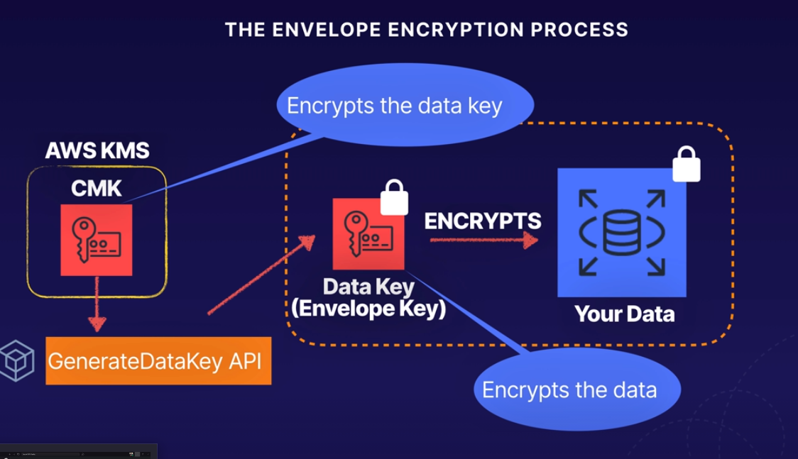

# AWS Developer Certificate Notes

This section introduces the major AWServices by category.

To access AWServices, you can use:

* AWS Management Console
* Command Line Interface (CLI using AWS CLI)
* Software Development Kits (SDKs)

## Analytics

### -- Amazon Athena

Athena is an interactive query service used to analyze data in Amazon S3. This SaaS has no infrastructure to manage, and you pay only for queries ran.

To use it, simply point your data in Amazon S3, define the schema, and start querying using SQL. Data is returned within seconds, and there is no need for extract, transform and load (ETL) jobs to massage your data for analysis, Athena does it for you.

Benefits include, but not limited to:

* Athena uses Presto with ANSI SQL support and works with a variety of data formats, including CSV, JSON, ORC, Avro, and Parquet.
* Athena uses Amazon S3 as its data store, so it is highly available and durable, as well as cheap
* Pay per queries ran. You are charged $5 per TeraByte scanned by queries. To save on queries, use compression, portioning, and converting data into columnar formats
* Athena is fast, as it executes queries in parallel, so you’ll get data back within seconds
* Run federated queries against relational DBs, data warehouses, object stores, and non-relational data stores
* Create your own user-defined functions (UDF), and invoke one or multiple UDFs from your SELECT and FILTER clauses
  * Some custom functions include compressing and decompressing data, redacting sensitive data, or applying customized decryption
* Invoke Machine Learning models for inference directly from SQL queries using Athena, and integrate with Amazon SageMaker’s learning algorithms
  * The ability to use Machine Learning models in SQL makes complex tasks such as anomaly detection, customer cohort analysis and sales predictions as simple as invoking a function in a SQL query
* Athena is out-of-the-box integrated with AWS Glue Data Catalog, allowing you to create a unified metadata repo across various services, crawl data sources to discover schemas and populate your Catalog with new and modified table and partition definitions to maintain schema versioning

### -- Amazon EMR

Amazon Elastic MapReduce (EMR) is a tool for big data processing and analysis. Using open source tools, coupled with the scalability of AWS EC2 and storage of Amazon S3, EMR can run PetaBytes scale analysis for a fraction of the cost of traditional on-prem clusters.

Some of the benefits to use EMR are:

* Easy to use — EMR is easy to use because you don’t worry about infrastructure setup, node provisioning, Hadoop configuration, or cluster tuning. Data lovers can launch a server less Jupyter notebook in seconds using EMR Notebooks
* Elastic and Flexible — Unlike the rigid infrastructure of on-prem clusters, EMR decouples compute and persistent storage, to scale each independently, rather than having to buy hardware for storage running out when there is no need for additional compute power. You also have full control and root access to every instance, so additional apps can be installed to customize every cluster. There’s also an option to launch EMR clusters with custom Amazon Linux AMIs, and reconfigure already running clusters on the fly, without having to re-launch existing, running clusters
* Reliable — EMR is tuned for the cloud, and constantly monitors your cluster — retrying failed tasks and automatically replacing poorly performing instances to fix compute performance issues.
* Secure — EMR automatically configures EC2 firewall settings controlling network access to instances, and launches clusters in an Amazon Virtual Private Cloud (VPC), a logically isolated network you define.
* Low cost - big data workloads for less saving up to 90% using EC2 Spot Instances, using S3 for data lakes for free using EMR services

Some of the use cases for EMR are:

* Machine learning — easily add your preferred libraries and tools to create your own predictive analytics toolkit
* Extract, Transform and Load (ETL) — quickly perform data transformation workloads (ETL) such as - sort, aggregate, and join - on large data sets
* Clickstream analysis — using Apache Spark and Apache Hive to segment users, understand user preferences, and deliver more effective ads
* Real-time streaming — create long-running, highly available, and fault-tolerant streaming data pipelines by analyzing events from Apache Kafka, Kinesis or any real-time streaming data source with Apache Spark Streaming and EMR
* Interactive analytics — EMR Notebooks provide a managed analytic environment based on open source Jupyter to prepare and visualize data, collaborate with peers, build apps, and perform interactive analysis
* Genomics — process vast amounts of genomic data and other large scientific data sets quickly and efficiently

### -- Amazon CloudSearch

CloudSearch is a SaaS that makes it simple and cost-effective to setup, manage and scale a search solution for your app. CloudSearch supports 34 languages and popular search features such as:

* Highlighting
* Autocomplete
* Geospatial search
* Custom relevance ranking and query-time rank expressions
* Field weighting

Cost is based on usage, but the good thing is that it uses S3 as data storage and recovery, and customers get this for free, which is a significant cost saving over self-managed search infrastructure. Customers are billed based on usage across the following dimensions:

* Search instances
* Document batch uploads
* IndexDocuments requests
* Data transfer

### -- Amazon Elasticsearch Service

Elasticsearch is a fully managed service that makes it easy to build, deploy, secure, monitor and troubleshoot applications.

Some of the benefits are:

* Easy to deploy and manage — service simplifies management tasks such as hardware provisioning, software installation and patching, failure recovery, backups, and monitoring
* Highly scalable and available — lets you store up to 3 PB of data in a single cluster, enabling you to run large log analytics via a single Kibana interface
* Kibana — With Elasticsearch service, Kibana is deployed automatically with your domain as a fully managed service, automatically taking care of all the heavy-lifting to manage the cluster
* Highly secure - achieve network isolation using VPC, encrypt data at-rest and in-transit using keys managed through AWS KMS, and manage authentication and access control with Cognito and IAM policies
  * HIPAA eligible, and compliant with PCI, DSS, SOC, ISO, and FedRamp standards
* Low cost — pay only for the resources you consume by selecting on-demand pricing with no upfront costs or long-term commitments, OR get significant savings by getting a Reserved Instance pricing

Some use cases are:

* Application monitoring — log data to find and fix issues faster and improve app performance by receiving automated alerts if app is under performing
* Security Info and Event Management (SIEM) — centralize and analyze logs from disparate applications and systems across your network for real-time threat detection and incident management
* Search — same features as CloudSearch
* Infrastructure monitoring — collect logs from servers, routers, switches, virtualized machines to get a view detailed view into your infrastructure, reducing Mean Time To Detect (MMTD) and Resolve (MMTR) issues and lowering system downtime

### -- Amazon Kinesis

Kinesis makes it easy to collect, process and analyze video and data streams in real-time. Kinesis enables you to process and analyze data as it arrives, instead of having to wait for it to begin processing.

Amazon Kinesis capabilities include:

* Kinesis Video Streams
  * Ingests and stores video streams to use in custom apps for analytics, ML, playback...


* Kinesis Data Streams (KDS)
  * Takes care of getting the data streamed to storage, streams such as: DB event streams, website click streams, social media feeds, IT logs, location-tracking events


* Kinesis Data Firehose
  * Think of the name firehose and the shape of it, now think of data flowing through that actual hose, that is the data streaming into data stores and analytic tools


* Kinesis Data Analytics
  * Analytics happen at the end of the data stream to generate the output


Major benefits from Amazon Kinesis:

* Real-time data metrics ingestion, buffering and processing
* Fully managed infrastructure
* Scalable to stream and process data from a variety of sources

Some use cases:


### -- Amazon Redshift

Redshift is used for data warehouse and OLAP (online analytics processing).

Redshift is cloud data lakes and/or warehouse services. Redshift has been improved by using ML, massively parallel query execution, and columnar storage on high-performance disk.  Redshift allows you to query petabytes of data (structured or unstructured) out of your data lakes using standard SQL.  

Redshift AQUA (Advanced Query Accelerator) is a new distributed and hardware accelerated cache that allows Redshift to run 10x faster than any other data lake or warehouse.

Some use cases for Redshift:

* Business Intelligence (BI) reports built by analyzing all of your data, data lake, or data warehouse.
* Use mixed structured data from a data lake and semi-structured data such as app logs to get operational insights on your apps and systems

### -- Amazon QuickSight

QuickSight is a BI service used to efficiently deliver insights to everyone in an org.  You can build interactive dashboards that can be accessed from mobile or web that provide powerful self-service analytics. QuickSight scales to thousands of users without any software, servers, or infrastructure to deal with and buy. It is a pay-as-you-go service with no upfront costs or annual commitments.

Benefits:

* Pay only for what you use
* Scale to all your users
* Embed analytics in apps
* Built end-to end BI reports

How it works...


Some use cases include:

Using QuickSight in interactive dashboards for BI


Create dashboards for ML anomaly detection, pattern seeker, forecasting, and data auto-narratives


Enhance custom apps by embedding QuickSight dashboards


BI sent via email


### -- AWS Data Pipeline

Data Pipeline allows you to process and move data from different AWS resources such as compute and storage services, as well as on-prem storage. The results can be stored in S3, RDS, DynamoDB or EMR. As with most AWS services, you don’t have to worry about creating complex data processing workloads that are fault tolerant, highly available, and repeatable, or worry about resource availability or inter-task dependencies.  Even if something fails after retries, AWS Data Pipeline will send you notifications via AWS Simple Notification Service (SNS).

Data Pipeline makes it so easy to use that their drag-and-drop console allows you to create a file search function in S3 within a few clicks. There are a number of Data Pipeline templates to create pipelines for complex use cases.

### -- AWS Glue

Glue is a fully managed ETL SaaS that makes it easy to prepare and load data for analytics. Simply point AWS Glue to the data storage on AWS, and Glue will crawl your data, suggest schemas and transformations, and store associated metadata in the AWS Glue Data Catalog.

Once cataloged, data is immediately searchable, query-able and available for extract, transform and load (ETL).

Some use cases are:

* Queries against an S3 Data Lake


* Analyze log data in S3 to enrich data set and generate BI reports


* One-stop-shop for multiple data stores


* Event-driven ETL data pipelines


### -- AWS Lake Formation

Lake Formation makes it easy to setup a secure data lake in days. A **data lake** is a centralized, curated and secured repo that stores all your data, in original form and prepared for analysis.

Point Lake Formation at the data sources that you want to move into Lake Formation, and it moves it cleanly taking care of the right schema and metadata, along with choosing security policies and encryption for your data to be used in analytic services.

How it works:

* Everything that the orange box touches is Lake Formation’s kingdom


### -- Amazon Managed Streaming for Kafka (MSK)

MSK is a fully managed service that helps you build and run apps that use Apache Kafka to process streaming data. With MSK, you can use Kafka API to populate data lakes, stream changes to and from DBs, and power ML and analytics apps.

**Apache Kafka** is a streaming data store that decouples apps producing streaming data (producers) into its data store from apps consuming streaming data (consumers) from its data store. Companies use Kafka as a data source for apps that continuously analyze and react to streaming data.

Once again, AWS makes it easy to manage the MSK infrastructure taking care of most of the heavy lifting. AWS takes care of monitoring Kafka clusters and replaces unhealthy nodes with no downtime to your app.

Benefits:

* Fully compatible
  * Easy to migrate and run existing Kafka apps on AWS w/out changes to your app’s source code
  * You can continue using custom and community built tools such as MirrorMaker, Apache Flink (streaming), and Prometheus.
* Fully managed by AWS
  * MSK manages the provisioning, config and maintenance of Apache Kafka clusters and Apache ZooKeeper nodes
* Elastic stream processing
  * Run fully managed Apache Flink apps that elastically scale to process data streams w/in MSK
* Highly available
  * Multi-AZ replication within an AWS Region
* Highly secure
  * VPC network isolation, AWS IAM for API auth, encryption at rest, TLS encryption in-transit, TLS based certificate auth, and supports Kafka Access Control Lists (ACLs) for data auth.


## Application Integration

### -- Step Functions --

* Coordinate multiple AWS services into **serverless** workflows so you can develop and deploy apps quickly
* Workflows are made up of a series of steps, and translates your workflow into a state machine diagram that is easy to understand and update
* Output from one step may act as an input to the next
* Provide orchestration for serverless apps
* Provides logs of each step to debug/troubleshoot which step failed
* Use cases:
  * Sequential workflow
  * Parallel workflow
  * Branching workflow
* Each of the steps is a Lambda function
* Builds everything automatically using CloudFormation
* Advantages
  * Visualize serverless app
  * Automate step functions to use the output of one step as input to the next step
  * Logging the state of each step is done automatically to track what went wrong and where

### -- Amazon MQ

MQ is a managed message broker service for Apache ActiveMQ.

What are message brokers? They allow different software systems — often using different programming languages, and on different platforms — to communicate and exchange information. MQ reduces operational load by managing the provisioning, setup, and maintenance of ActiveMQ.

What is ActiveMQ? An open source message broker written in Java together w/a full Java Message Service (JMS).

### -- Simple Queue Service (SQS) --

A queue is a temporary repository for messages waiting processing. Simple Queue Service (SQS) is a fully managed SaaS to decouple and scale micro services, distributed systems, and serverless apps. SQS eliminates the complexity and overhead associated with managing and operating message oriented middleware.

SQS messages can contain up to 256KB of text in any format (i.e. XML, JSON and unformatted text). SQS is pull-based, not pushed-based. Messages can be kept in the queue from one minute to 14 days, default retention rate is 4 days. If an app crashes on an EC2 or ECS, then the queue will retain all messages and wait for the next consumer to be ready to process them.

A queue resolves issues that arise if the producer is producing work faster than the consumer can process it, OR if the producer or consumer are only intermittently connected to the network.

SQS offers common constructs such as **dead-letter queues** and **cost allocation tags**. It provides generic web services API and it can be accessed by any programming language that the AWS SDK supports.

#### Two types of SQS

* Standard queue - default type, offers max throughput, best-effort ordering, duplicates could occur and at least-once delivery
* First in, first out queue (FIFO) - designed to guarantee messages are processed exactly once, in the exact order that they are sent, duplicates are not introduced, 300 transactions p/second (TPS) limit
  * Good for banking transactions which need to happen in a stric order

**Visibility Timeout** feature allows for a message to be set as "invisible" for another consumer after/while being processed. Default time is 30 seconds. If job is not processed within the 30 seconds, the message will be made available for another consumer to pick it up and process it. Increase timeout if necessary. Maximum is 12 hours.

**Short polling** returns a response immediately even if queue being polled is empty. This can result in additional incurred costs, bc empty responses are billable.

**Long polling** periodacillay polls the queue. It doesn't return a response until a message arrives in the queue or the long poll times out. It could save some money on bill, so it is preferable over short polling. Long poll has a maximum of 20 seconds for a long-poll timeout.

**SQS Delay queue** postpones delivery of new messages for a number of seconds. Messages will remain "invisible" to consumers for the duration of the delay period. Default dealy is 0 seconds, maximum is 900 seconds (15 minutes). This will definitely affect the FIFO queues for existing messages.

Manage large SQS messages (25KB - 2GB) by using S3. You'll need the AWS SDK for Java and the SQS Extended Client Library for Java to get, put and delete S3. You CANNOT do this using AWS CLI, AWS Management Console / SQS Console, SQS API.

##### SQS Examples

SQS decouples app components so they can run independently, easing message management between components.

When creating a 2-tiered service, for example an app with premium (paid) and basic (non-paid) customers, you'd want to give preference for paid customers, so you can do that with SQS by creating 2 separate SQS queues, so messages can be processed by the app from the high priority queue first (paid) then basic customers can access the app second.

### -- Simple Notification Services (SNS)

A service that makes it easy to set up, operate, and send notifications from AWS.

Simple Notification Services (SNS) is a highly available, durable, secure, fully managed publisher/sub messaging service that enables you to decouple micro services, distributed systems, and serverless apps.

Using Amazon SNS topics, your pub system can disperse messages to a large number of subscriber endpoints for parallel processing.

SNS can be used to send notifications to end users using:

* Mobile push notifications
  * Devices available
    * Apple
    * Google
    * Fire OS
    * Windows
    * Android
* SMS text message
* Email
* SQS queue
* Any HTTP endpoint

You can also use a **Trigger Lambda** functions to process the message, publish to another SNS topic, or send message somewhere else.

Pub-sub model is where applications **publish** or **push** messages to a *topic*; subscribers **receive** messages from a *topic*, hence the pub, publish and sub, subscribe model.

A **topic** is an access point, allowing recipients to subscribe to and receive copies of the same notification. SNS delivers appropriately-formatted messages to e/subscriber (e.g. iOS, Android, SMS, etc.)

SNS offers durable storage by storing messages redundantly across multiple Availability Zones (AZs).

SNS Benefits:

* Instantaneous, push-based delivery (no polling)
* Simple to setup with API
* Flexible for different transport protocols
* Inexpensive, pay-as-you-go model w/no up-front costs
* Easy to configure on AWS Console
* High availability expected for a Production environment

### -- Amazon SWF

Simple Workflow (SWF) is a fully managed state tracker and task coordinator.

## AR and VR

### -- Amazon Sumerian

With Sumerian, create and run VR, AR, and 3D apps quickly and easily without any specialized programming or 3D graphics expertise (disclaimer: expertise is not the same as experience, so some experience would definitely help). Sumerian allows you to create all the building blocks needed to build highly immersive and interactive 3D experiences including adding objects, and designing, animating, and scripting environments.

## AWS Cost Management

### -- AWS Cost Explorer

Interface that lets you visualize, understand, and manage your AWS costs and usage over time.

### -- AWS Budgets

Set custom budgets that alert you when your AWS costs or usage exceed (or are forecasted to exceed) your budgeted amount.

### -- AWS Cost & Usage Report

Lists AWS usage for each service category used by an account an its IAM users in hourly or daily line items, as well as any tags that are activated for cost allocation purposes.

### -- Reserved Instance (RI) Reporting

Visualize RI data at an aggregate level or inspect a particular RI subscription.

## Blockchain

### -- Amazon Managed Blockchain

Create and manage scalable blockchain networks using open source frameworks Hyperledger Fabric and Ethereum. Managed Blockchain eliminates the overhead required to create the network, and automatically scales to meet the demands of thousands of apps running millions of transactions at once.

In addition, Managed Blockchain can replicate an immutable copy of your blockchain network activity into Amazon Quantum Ledger Database (QLD) to analyze the network activity outside the network and gain insights into trends.

## Business Applications

### -- Alexa for Business

With Alexa for Biz, employees can use Alexa as their intelligent assistant to be more productive in meeting rooms, at their desks, and even with the Alexa devices they already have at home.

### -- Amazon WorkDocs

A fully-managed, secure enterprise file storage and file sharing service with strong admin controls and feedback capabilities.

### -- Amazon WorkMail

Secure, managed business email, contacts and calendar service with support for existing desktop and mobile email client apps.

Integrate WorkMail with existing corporate directory, use email journaling to meet compliance requirements, and control both keys that encrypt your data and the location in which your data is stored.

### -- Amazon Chime

Use Chime for online meetings, video conference, calls, chat, and to share content, both inside and outside the organization.

## Compute

### -- Elastic Cloud Compute (EC2) --

EC2 services are cloud hypervisors providing you with complete control of your computing resources. EC2 changes the economics of computing by allowing you to pay only for compute usage only.

There are 3 types of EC2 Instances:

* On-demand - pay for compute capacity by the hour or second with no long-term commitments
* Reserved Instances - discount up to 72% compared to **on-demand** instance prices
  * Great if you have known, fixed requirements
* Spot Instances - discount up to 90% compared to on-demand instance prices, and lets you take advantage of unused EC2 capacity in the AWS cloud
  * Prices fluctuate with supply and demand
  * Great for apps with flexible start and end times
* Dedicated Instances - a physical EC2 server dedicated for your use
  * Great if you have server-bound licenses to reuse or **compliance requirements**

#### EC2 Instance Profiles and IAM Roles

Use `aws cli` to create a role and assumre a role from an instance profile. Command sample below:

```sh
aws iam create-role --role-name DEV_ROLE --assume-role-policy-document file://path_to_file.json
```

You can also create a policy:

```sh
aws iam create-policy --policy-name DevS3ReadAccess --policy-document file//path_to_file.json
# OUTPUT
# Policy creted in json format
```

Then, you can attach policy to the role created previously:

```sh
aws iam attach-role-policy --role-name DEV_ROLE --policy-arn "arn:aws:iam::545353234343:policy/DevS3ReadAccess"
# NO OUTPUT
```

To confirm that the policy was attached to the role, run:

```sh
aws iam list-attached-role-policies --role-name DEV_ROLE
# OUTPUT
# Attached policies to role in json format
```

Then, we can create an `instance-profile` as such:

```sh
aws iam create-instance-profile --instance-profile-name DEV_PROFILE
# OUTPUT
# Instance profile in json format
```

Then, add the role to the instance-profile:

```sh
aws iam add-role-to-instance-profile --instance-profile-name DEV_PROFILE --role-name DEV_ROLE
# NO OUTPUT
```

Confirm with running:

```sh
aws iam get-instance-profile --instance-profile-name DEV_PROFILE
# OUTPUT
# Instance profile with roles attached in json format
```

Run the following to associate IAM instance profile with EC2's instance ID, so copy it from the console:

```sh
aws ec2 associate-iam-instance-profile --instance-id i-035fd342fd3be93b -iam-instance-profile Name="DEV_PROFILE"
# OUTPUT
# IAM instance profile association in json format
```

Lasty, confirm by describing EC2 instance and seeing details for IAM instance profile:

```sh
aws ec2 describe-instances --instance-ids i-035fd342fd3be93b
# OUTPUT
# EC2 details in json format
```

To run a last double-check, run the following to see the role in the EC2 instance:

```sh
aws sts get-caller-identity
# OUTPUT
# STS token with ARN role name
```

#### EC2 Auto Scaling

EC2 Auto Scaling helps you maintain app availability and allows you to automatically add or remove EC2 instances according to user-defined conditions.

### -- Amazon Elastic Container Registry (ECR)

ECR is a fully-managed Docker container registry that makes it easy for developers to host, store, manage, and deploy Docker container images.

ECR is integrated with Amazon Elastic Container Service (ECS), simplifying development to production workflow.

Integration with AWS IAM provides resource-level control of each repository.

You pay only for the amount of data stored in repositories and data transferred to the Internet.

### -- Amazon Elastic Container Store (ECS)

ECS is a container orchestration service that supports Docker containers and allows you to easily run and scale containerized apps on AWS.

With API calls, launch and stop Docker-enabled apps, query the complete state of apps, and access many familiar features, such as IAM roles, security groups, load balancers, CloudWatch Events, CloudFormation templates, and CloudTrail logs.

### -- Amazon Elastic Container Service for Kubernetes (EKS)

EKS runs the Kubernetes management infrastructure for you across multiple AWS AZs to eliminate single point of failure.

EKS is certified Kubernetes so you can use existing tooling and plugins from partners and the Kubernetes community.

### -- Amazon Lightsail

Launch and manage a virtual private server with AWS, which includes everything needed to jumpstart a project — a virtual machine, SSD- based storage, data transfer, DNS management, and a static IP address.

### -- AWS Batch

Batch dynamically provisions the optimal quantity and type of compute resources based on the volume and specific resource requirements of the batch jobs submitted.

### -- Elastic Beanstalk ---

Elastic Beanstalk deploys and scales web apps and services developed with Java, .NET, PHP Node.js, Python, Ruby, Go, and Docker on familiar servers such as Apache, Nginx, Passenger, and Internet Information Services (IIS).

Elastic Beanstalk provisions AWS resources for you and deals with systems administration tasks, such as OS and app server udpates, monitoring, metrics, health checks, etc.

Elastic Beanstalk can fully manage the EC2 instances for you or you can take full administrative control.

#### Elastic Beanstalk Configuration Files

Configure your platform by defining packages to install, create Linux users and groups, run shell commands, enable services, load balancer configuration, etc.

These files can be written in `YAML` or `JSON`.

The file MUST have a `.config` extension and be inside a folder called `.ebextensions` dir (must be in top-level dir of app source code bundle). Config file could be placed under your source control with the rest of your app code.

#### Elastic Beanstalk Custom Platforms

Elastic Beanstalk supports custom platforms. A **custom platform** lets you develop an entire new platform from scratch, customizing the OS, additional software, and scripts that Elastic Beanstalk runs on platform instances. This allows you to build a platform for an app that uses a language or other infrastructure software, for which Elastic Beanstalk doesn't provide a platform out of the box.

To create a custom platform, you build an Amazon Machine Image (AMI) from one of the supported OSs and add further customizations. You create your own Elastic Beanstalk platform using **Packer**, which is an open-source tool for creating machine images for many platforms, including AMIs for use w EC2s.

Platform created in Elastic Beanstalk is highly configurable.

#### Updating Elastic Beanstalk

Upload a new application version, but it will not be deployed anywhere until you configure it based on deployment type. In actions, you'll need to select "Deploy" on the new version uploaded.

In Elastic Beanstalk environment's Configuration for your project, go to "Modify rolling updates and deployments" to select deployment type.

#### Deployment Types

* **All at once**: deploys to all hosts concurrently
  * You will experience a total outage
  * Ideal for testing environments  
  * Not ideal for mission-critical systems
  * Involves a service interruption  
  * If update fails, a rollback will be needed to change to original version for all of your instances
* **Rolling**: deploys the new version in batches
  * Each batch is taken out of service while the deployment takes place
  * Environment capacity will be reduced by the number of instances in a batch while the deployment takes place
  * Ideal for local websites with low traffic  
  * Not ideal for mission-critical systems
  * If update fails, rollbacks will be needed per batch deployed, so it will take a bit of time
* **Rolling with additional batch**: launches an additional batch of instances, then deploys the new version in batches
  * Rolling VS Rolling with additional batch, environment capacity will NOT be reduced
  * If update fails, rollbacks will be same as Rolling type, so it will take a bit of time
* **Immutable**: deploys the new version to a fresh group of instances before deleting the old instances
  * Once new instances pass their health checks, old instances should be terminated
  * If update fails, just delete the new instances and keep the original instances, so it is instantaneous
  * IDEAL for mission-critical systems
  * Performs an immutable update to launch a full set of new instances running the new version of the app in a *separate* Auto Scaling group, alongside the instances running the old version of the app
* **Traffic Splitting**: installs new version on a new set of instances, then forwards a percentage of incoming client traffic to the new app version for evaluation, and the rest to the old instances
  * Enables **canary testing** to test for errors before completely splitting traffic to all the new instances

#### Elastic Beanstalk and RDS

You can launch an RDS instance from within or outside an Elastic Beanstalk.

**Option 1**: Launch RDS Within Elastic Beanstalk - if you terminate the environment, the DB will be terminated

* Good for test environments

**Option 2**: Launch RDS Outside Elastic Beanstalk - use RDS console or AWS CLI to create RDS, so after tearing down your app env, you will not affect the DB instance

* Preferred approach for PROD environments for more flexibility

For option 2, you'd have to connect to your DB from your environment's Auto Scaling **security group**.

Also, you'll need to provide a connection string to your app servers using Elastic Beanstalk **environment properties** (in Configuration).

### -- AWS Fargate

A compute engine for Elastic Container Store (ECS) that allows you to run containers without having to manage servers or clusters, so it removes the need for you to interact with or think about servers or clusters to focus on building apps.

### -- Lambda --

Lambda runs code without provisioning or managing servers, **serverless**. There is no charge when code is not running with zero infrastructure administration.

Setup your code to automatically trigger from other AWServices, or call it directly from any web or mobile app.

To execute a Lambda function, Lambda uses a **handler** method. The **handler** is the name of the method within a code that calls to execute the function.

NOTE: Avoid using recursive code in your Lambda function, wherein the function automatically calls itself until some arbitrary criteria is met. This could lead to unintended volume of function invocations and escalated costs. If you do use recursive code in your Lambda function, set the function **concurrent execution limit** to ‘0’ (Zero) to throttle all invocations to the functions, while you update the code.

#### Upload New Lambda Code

There are diff ways to deploy your new/updated Lambda function code, some include:

1. Zip code into zip file and upload it via Lambda console
2. Write a CloudFormation template that will deploy your env including your code
3. Copy and paste code into the IDE inside Lambda UI

#### Lambda Event-Driven Architecture

Lambdas can be automatically triggered by other AWServices or called directly from any web or mobile app.

#### Lambda Triggers

* DynamoDB
* Kinesis
* SQS
* Application load balancer
* API Gateway
* Alexa
* CloudFront
* S3
* SNS
* SES
* CloudFormation
* CloudWatch
* CodeCommit
* CodePipeline

#### Using Versions with Lambda

Each Lambda function version has a unique ARN, after you publish a version, you CAN NOT change the ARN or the function code.

You can change a Lambda function code and settings ONLY on the **unpublished** version of a function. W

hen you publish a Lambda function version, the code and most of the settings are **locked** to ensure a consistent experience for users of that version.

This version is titled as `$LATEST`, and when a new version is published, the new version becomes the latest.

#### Using Aliases with AWS Lambda

An alias is like a pointer to a specific version of the function code.

You can create multiple versions and use different aliases to reference the version you want to use as part of the ARN (Amazon Resource Name).

* `arn:aws:lambda:eu-west-2:343628538798:function:mylambda:Test` -> Version2
* `arn:aws:lambda:eu-west-2:343628538798:function:mylambda:Prod` -> Version1
* `arn:aws:lambda:eu-west-2:343628538798:function:mylambda:$LATEST` -> Version2

If app uses an alias, instead of `$LATEST`, remember that it will not automatically use new code versions until alias is updated, or app is pointed to `$LATEST`.

#### Enabling Lambda to Access VPCs Resources

* Lambda needs to be allowed to connect to the private subnet
* Lambda needs VPC Configuration info so that it may connect to the VPC
  * Private subnet ID
  * Security group ID (with required access)
  * Lambda uses this info to set up Elastic Network Interfaces (ENIs) using an available IP address from your private subnet
  * Lambda uses the VPC info to set up ENIs using an IP from the private subnet CIDR range
* If Lambda fails to access VPC, that is because its IAM Role is not allowed to assign ENIs, so make sure it has the right permissions

Using the CLI to update VPC config, you can use something like:

```shell
aws lambda update-function-configuration --function-name my-function --vpc-config SubnetIds=subnet-1122aabb,SecurityGroupIds=sg-51540123
```

The command above uses the subnet ID to grab an available IP address, and a security group to allow it to access the AWS resources to do what it needs to do.

#### Lambda Advantages

* Lower cost than EC2 - extremely cost effective - pay only when your code executes
* Lambda scales automatically so you get continuous scaling
* Independent - each event will trigger a single function
* Serverless technology

#### Lambda Disadvantages

* Concurrent execution limits a certain amount of functions in a given region per account ("safety feature")
  * 1,000 concurrent executions per region, 1,001 will receive an error with `TooManyRequestsException`
  * HTTP Status Code: `429`
  * Requests throughput limit exceeded
  * Limit can be requested to be increased by AWS Support
  * **Reserved concurrency** feature guarantees a set number of concurrent executions to always be available for critical processes using Lambda
* Erros can come up due to execution time being too long
  * Debug edge cases and increase timeout inside the function

#### Lambda Charges

Lambdas are priced based on:

* Requests: first 1,000,000 requests per month are free
  * $0.20 per month per 1,000,000 requests
* Duration: charged in ms (millisecond) increments
* Memory: price per GB per second
  * Fractions of a penny's penny GB per second
  * First 400,000 GB per second per month are free

### -- AWS Serverless Application Repository

Quickly deploy code samples, components, and complete apps for common use cases such as web and mobile back-ends, event and data processing, logging, monitoring, IoT, and more.

AWS Serverless Application Model (SAM) template defines the AWS resources needed for your Serverless Application Repository.

AWS SAM templates can be used to embed application from Amazon S3 bucket. The resource can be nested from S3 as `AWS::Serverless::Application`.

With Serverless Application Repository, publish your own apps and share them within your team, across your org, or with the community at large.

### -- AWS Outposts

Outposts can be used to support on-prem workloads needed to remain on-premises due to low latency or local data processing needs.

### -- VMWare Cloud on AWS

VMWare Cloud on AWS is ideal for infrastructure and operations looking to migrate their on-prem vSphere-based workloads to the public cloud, consolidated and extend their data center capacities, and optimize, simplify and modernize their disaster recovery solutions.

With VMWare Cloud on AWS, organizations can simplify their hybrid IT infrastructure by using the same VMWare Cloud Foundation technologies across their on-prem data centers and on the AWS Cloud without having to purchase any new or custom hardware, rewrite apps, or modify their operating models.

## Customer Engagement

### -- Amazon Connect

A self-service, cloud-based contact center service that makes it easy for any business to deliver better customer service at lower cost.

### -- Amazon SES

Simple Email Service (SES) is a cloud-based email sending service designed to help digital marketers and app developers send marketing, notification, and transactional emails. SES uses a pay-as-you-go model.

You can use SES to send and receive email, incoming emails will be delivered to an S3 bucket. Incoming emails can be used to trigger Lambda functions and SNS notifications.

Use cases:

* Automated emails
* Online purchases confirmations
* Order status updates
* Marketing emails
* Ads
* Newsletters
* Events

## Database

### -- Amazon Aurora

Aurora is a MySQL and PostgreSQL compatible relational DB engine that combines the speed and availability of high-end commercial DBs w/the simplicity and cost-effectiveness of open source DBs.

Aurora is up to 5x faster than standard MySQL and 3x faster than standard PostgreSQL DBs.

Aurora features a distributed, fault-tolerant, self-healing storage system that auto-scales up to 64TB per DB instance.

### -- Relational Database Service (RDS) --

RDS is used for OLTP (online transaction processing). It is great for:

* Processing lots of small transactions
  * Customer orders
  * Banking transactions
  * Payments
  * Booking systems

RDS is not suitable for **OLAP** (online analytics processing). Use **RedShift** for OLAP and data warehousing tasks like analyzing large amounts of data, reporting, and sales forecasting.

RDS makes it easy to setup, operate and scale relational DBs in the cloud.

There are several DB instance types:

* Optimized for memory
* Performance or Input/Output

There are 6 familiar DB engines to choose from, including:

* Amazon Aurora: not availabe on free tier
* PostgreSQL
* MySQL
* MariaDB
* OracleDB
* SQL Server

Amazon RDS offers **Read Replicas** that provide enhanced performance and durability for DB instances. This feature makes it easy to elastically scale out beyond the capacity constraints of a single DB instance for read-heavy workloads, thereby increasing aggregate read throughput.

#### RDS Automated Backups

Automated backups allow you to recover your DB to any point in time within a **retention period**, which can be from 1 - 35 days. This option gives you more bang for your buck compared to manual DB snapshot.

User can select the backup retention period and backup window in which automated backups are created, including start time (UTC) and duration (hours).

Automated backups take a full daily snapshot and will store **transaction logs** throughout the day. This allows to do a point in time recovery down to a second, within the retention period.

Automated backups are enabled by default. Backup data is stored in S3 and free, data size storage in S3 = RDS instance size, so if you have a 10GB DB, then you will get 10GB free worth of storage in S3.

Backups are taken within a defined window, i.e. between 2am - 5am.

During backup, **storage I/O may be supsended while your data is beiing backed up**, and you may experience increased latency.

#### RDS Database Snapshots (Manual)

DB Snapshots are done manually (user initiated). It provides a snapshot of the storage volume attached to the DB instance.

Stored even after you delete the original RDS instance, unlike automated backups.

You can backup to a known state as frequently as you wish, and then restore to that specific state in time.

#### Restoring RDS Backups

Any time an automated backup or snapshot is used, the restored version of the DB will be the new RDS instance with a new DNS endpoint.

#### RDS Encryption

Backups are encrypted at rest.

Enable encryption at creation time, selecting the encryption option in the console.

Encryption is done using the AWS Key Management Service (KMS) service, AES-256 encryption.

Once DB is encrypted, any copies, logs or backups are going to be encrypted as well, including any other underlying storage.

Encrypting an existing non-encrypted DB instance is not supported, so user will have to:

1. Create a snapshot of the RDS instance
2. Make a copy of that snapshot
3. In the copy snapshot settings, encrypt the copy of the snapshot
4. Do a DB restore with the encrypted snapshot

#### Multi-AZ RDS

For disaster recovery only!

Multi-AZ allows to have an exact copy of PROD DB in another AZ (availability zone).

AWS handles the replication for users, so changes to PROD DB will automatically be synced to the stand by DB.

In the event of planned DB maintenance, DB instance failure, or an AZ failure, RDS will automatically failover to the standby DB so that DB ops can resume quickly w/out admin intervention.

#### Read Replica

Improves read performance.

You can have 5 read replicas per PROD DB by default in the same AZ, cross-AZ, or cross-region.

You can also have read replicas of read replicas, but you will have some replication latency.

Ideal for read-heavy workloads such as user reports.

Read-only of PROD DB. Achieved using Asynchronous replication from primary RDS instance to the read replica.

Must have automated backups in order to deploy a read replica. Each read replica will have its own DNS endpoint.

You can have read replicas that have Multi-AZ, and in another region.

Available for:

* MySQL server
* PostgreSQL
* MariaDB
* Aurora

Read replicas can be promoted to be their own DBs, but will break the replication.

### -- Amazon RDS on VMWare

Amazon RDS on VMWare lets you deploy managed DBs in on-prem VMWare environments using Amazon RDS.

RDS on VMWare allows you to utilize the same simple interface for managing DBs in on-prem VMWare environments as you would use in AWS.

### -- DynamoDB --

DynamoDB is a key-value and document DB that delivers single-digit millisecond performance at any scale. Highly scalable and highly computeable.

DynamoDB consists of tables, items and attributes. Compared to SQL's tables, rows (records) and columns.

#### DynamoDB Queries

Queries can only use the primary key attribute.

To query or scan certain attributes and not all, you can use the `ProjectExpression` parameter to refine results.

Results are sorted by *sort* key, in numeric order by default. To reverse the order, set the `ScanIndexForward` parameter to `false`.

#### DynamoDB Scans

A scan op examines e/item in the table, and returns all data attributes by default. Add filters to return only desired items.

Avoid scans. However, if you want to use scans, here are a few ways to improve scan performance:

* Improve performance by setting a smaller page size
* Configure DynamoDB to use **parallel scans** by logically dividing a table or index into segments and scanning each segment in parallel
  * Avoid parallel scans if your table or index is already incurring heavy read/write activity from other applications
* Isolate scan ops to specific tables and segregate them from your mission-critical traffic
  * Even if that means writing data to 2 different tables

#### DynamoDB Query VS Scan

Query is more efficient, bc a scan first pulls all the items, then filters out to provide desired result. As data grows, scans will take longer to dump all items then filter. A scan can take all the provisioned throughput in a single op.

In general, try to design tables in a way that you can use the `Query`, `Get` or `BatchGetItem` APIs.

#### DynamoDB Primary Keys

**Primary key** is used to store and retrieve data by DynamoDB.

2 types of primary keys:

* Partition key: based on a unique attribute, i.e. customer_id, product_id or car's VIN
  * Value is used as input to internal hash function, and the output determines the partition or physical location on DynamoDB where the data is stored
  * All items w/same partition key are stored together and sorted accordingly per sort key value
* Composite key (partition key + sort key)
  * When unique key is not going to be a unique value, such as in forum posts when using user_id as partition key will not be unique, so a sort key (timestamp) could be added to have a unique combination value

#### DynamoDB Secondary Index

You can run a query on non-primary key attributes using **global secondary indexes** and **local secondary indexes**.

Secondary index allows you to:

* Perform fast queries on specific columns
* Select columns you want included in the index and run searches on that index, rather than entire dataset

**Local Secondary Indexes** can only be created at moment of table creation, and cannot be updated or removed.

* *Same partition key* as original table, but a different sort key
* Gives a different view of data, organizing it with an alternative **sort key**
* Same provision throughput as original table

**Global Secondary Indexes** are more flexible and can be created at *any time*.

* Allows you to *use a different partition key and sort key*
* Completely different view of data
* Separate provision throughput for read/write
* Initial quota of 20 global secondary indexes per table, but you can request a service quota increase

#### DynamoDB Streams

Streams are time-ordered sequence of item level modifications (e.g. insert, update, delete). There is a **dedicated endpoint** to access DynamoDB Stream to store event logs encrypted at rest for 24 hours. Then, it starts deleting events.

By default, Streams only record primary key. It stores before and after images of the item requested.

Ideal for:

* Audit or archive transactions
* Trigger an event based on a particular transaction
  * A Stream can be an event source for Lambda
  * Lambda then polls DynamoDB Stream and executes based on an event
* Replicate data across multiple tables


#### DynamoDB Access Control

Controlling access to DynamoDB can be done using:

* IAM
* IAM permissions
* IAM roles

Restricting user access can be accomplished w/ an IAM condition to only their own records.

In an IAM policy, a condition needs to be added to only access the items where the partition key value matches, for example, a user_id. Example below (not json format):

* Statement ID (Sid): `AllowAccessToOnlyItemsMatchingUserId`
* Action: `dynamodb:GetItem`, `dynamodb:PutItem`, `dynamodb:UpdateItem`
* Condition: `ForAllValues:StringEquals: { dynamodb:LeadingKeys: ${www.mygame.com:user_id } }`
  * Attributes: `dynamodb:Attributes: [ UserId, GameTitle, TopScore ]`

In a nutshell, DynamoDB can have fine-grained access control with IAM using the IAM condition parameter `dynamodb:LeadkingKeys`, which allows users to access only the items where the `partitionKey == user_id`.

#### DynamoDB Advantages

* DynamoDB is serverless and integrates well with Lambda, so it is a popular choice for serverless applications
* DynamoDB is a low latency NoSQL DB, but that doesn't mean it's non-relational. It helps to start w/out a schema in mind
* Using DynamoDB for session storage alleviates issues that occur with session handling in a distributed web application by moving sessions off of the local file system and into a shared location
  * Amazon DynamoDB provides an effective solution for sharing session state across web servers without incurring drawbacks
* Supports both document and key-value data models
  * Supported docs: JSON, HTML and XML
* Uses SSD (solid state disks) storage fast performance for reads/writes.
* Resilient spread across 3 geo data centers
* 2 types of consistency reads:
  * **Eventually consistent reads**: consistency across all copies of data is usually reached within a second
    * Best for read performance
  * **Strongly consistent reads**: always reflects all successful writes
    * Writes are reflected across all 3 locations at once
    * Best for read consistency
    * DynamoDB transactions: ideal for ACID transactions (Atomic, Consistent, Isolated, Durable)
      * Read or write multiple items across multiple tables as an *all or nothing operation*, i.e. credit card charge
* DynamoDB maintains the **Entity Relational Modeling** (ERM)
* DynamoDB offers **server-side encryption** for **ALL** table data, so no additional configuration is required. This could be used to meet requirements that call for all data to be encrypted at rest.
* DynamoDB offers **DAX**, *DynamoDB Accelerator*

#### DynamoDB DAX (Accelerator)

DAX is a DynamoDB-compatible caching service that enables you to benefit from fast in-memory performance for demanding apps. For **eventually consistent reads** and **read** operations ONLY.

DAX is a write-through caching service. Data is written to the cache, and the backend store at the same time. API call can query the DAX cluster first, and if item is not found, it can then query DynamoDB to store it in cache and return it to the application. Further, requests will get a cache hit when they call DAX.

Reduces the read load on DynamoDB tables and save money on your AWS bill.

Delivers up to 10x read performance improvement. Microsecond performance for millions of requests per second.

Ideal for:

* Auction apps
* Game sites
* Sales apps, i.e. Black Friday sale traffic

**NOT** ideal for:

* Apps requiring **strongly consistent reads**
* Not suitable for write-intensive apps
* Apps that don't perform too many ops
* Apps that don't require microsecond response times, low latency response

DAX addresses 3 scenarios:

1. As an in-memory cache, DAX reduces the response times of eventually-consistent **read** workloads by an order of magnitude, from single-digit milliseconds to microseconds
2. DAX reduces operational and app complexity by providing a managed service that is API-compatible with DynamoDB, and thus requires only minimal functional changes to use w/an existing app
3. For read-heavy or fast bursts workloads, DAX provides increased throughput and potential operational cost savings by reducing the need to over-provision read capacity units. This is beneficial for apps that require repeated reads for individual keys

#### DynamoDB TTL (Time to Live)

DynamoDB also allows you to set **Time To Live (TTL)** for when items in a table need to be expunged and deleted from the database.

There has to be a TTL attribute in the table to add this feature. TTL is expressed in **epoch** or **unix** format, seconds elapsed after 12:00AM January 1, 1970.

TTL is provided at an extra cost as a way to reduce storage usage and reduce cost of storing irrelevant data w/out using provisioned throughput.

With TTL enabled on a table, you can set a timestamp for deletion on a per-item basis, allowing you to limit storage usage to only those records that are crucial to operations.

Great for removing irrelevant or old data, for example:

* Session data
* Event logs
* Temp data
* Reducing costs in DynamoDB

#### Determine Write Capacity

When working with write capacity, the rule is to divide the item size by `1KB`, round to the nearest `1KB`. Then, you multiple by the speed of items per second written to DynamoDB.

For example, if we are writing 10 items every second and each item is 15.5KB in size, you would:

1. `(15.5 KB/1 KB) = 15.5`
2. Round to the nearest `1KB` so 15.5 rounded up to 16KB
3. Multiple `16 KB * 10 items per second = 160 write capacity`

#### Determine Read Capacity

1 x **strongly consistent reads** of 4KB per second

OR

2 x **eventually consistent reads** of 4KB per second (default)

#### On-demand VS Provisioned Capacity

On-demand is great for:

* Unpredictable workloads
* Unknown workload
* Spiky, short-lived peaks
* New apps where you don't know what you're going to need
* Pay for usage/request

Difficult to predict cost, but you will have a pay-per-use model.

Provisioned is great for:

* Read and write capacity can be forecasted
* Predictable application traffic
* Application traffic is consistent or increases gradually

#### Provisioned Throughput Exceeded Exception Error

When request rate is too high for the `read/write` capacity provisioned on your DynamoDB table, `ProvisionedThroughputExceededException` error will be returned.

If you're using the AWS SDK, it will auto-retry the requests until successful, as it uses exponential backoff as default.

* If after 1 minute, AWS SDK auto-retry doesn't work, your request size may be exceeding the throughput for your read/write capacity.

If you're not using the AWS SDK, you could do either of the 2 methods below:

* Reduce your concurrent request frequency
* Use **exponential backoff**
  * Uses progressively longer waits between consecutive retries, for improved flow control

### -- ElastiCache --

ElastiCache makes it easy to deploy, operate, and scale in-memory cache in the Cloud.

ElastiCache improves the performance of web apps by allowing it to retrieve info from fast, managed, in-memory caches, instead of relying on slower disk-based DBs.

ElastiCache can be used to improve latency and throughput for many read-heavy app workloads or computer-intensive workloads. Cached info may include the results of I/O intensive DB queries or the results of computationall-intensive calculations.

There are 2 open source in-memory machine engines:

* **Redis** - a Redis-compatible in-memory service that delivers the ease-of-use and power of Redis along with the availability, reliability, and performance suitable for the most demanding apps
  * In-memory key-value store, lists and hashes, sets, etc.
  * Used for sorting and ranking datasets in memory, such as in leaderboards, etc.
  * Used for data persistence
  * Supports master/slave replication and Multi-AZ
  * Because of the replication and persistence features of Redis, ElastiCache manages Redis more as a realtional DB
    * Redis ElastiCache clusters are managed as stateful entities that include **failover**, similar to how RDS manages DB failover
* **Memcached** - a protocol compliant with Memcached
  * Features available w/Memchached are that it supports simple data types and has multi-threaded performance with utilization of multiple cores
  * Simplest way for object caching
  * Used for read-heavy and not prone to frequent changing
  * Pure caching solution w/no persistence
  * ElastiCache manages nodes as a pool that can grow and shrink, similar to EC2 Auto Scaling Group
  * Individual nodes are expendendable

### -- Amazon Neptune

Neptune is a fully-managed graph DB service that makes it easy to build and run apps that work with highly connected data sets.

Neptune is a purpose-built, high-performance graph DB engine optimized for storing billions of relationships and querying the graph with milliseconds latency.

### -- Amazon Quantum Ledger Database (QLDB)

QLDB provides a transparent immutable, and cryptographically verifiable transaction log owned by a central authority.

Ledgers are typically used to record a history of economic and financial activity in an organization. Ledger apps are often implemented using custom audit tables or audit trails created in relational DBs.

With QLDB, data change history is **immutable**, and using cryptography, you can easily verify that there have been no unintended modifications to app’s data.

QLDB provides developers with familiar SQL-like API, a flexible document data model, and full support for transactions. QLDB is also serverless, so it automatically scales to support the demands of your app.

### -- Amazon Timestream

Timestream is fully-managed time series DB service for IoT and operational apps to store and analyze trillions of events per day at 1/10th the cost of Relational DBs.

Time-series data has specific characteristics such as typically arriving in time order form, data is append-only, and queries are always over a time interval.

With Timestream, you can easily store and analyze log data for DevOps, sensor data for IoT apps, and industrial telemetry data for equipment maintenance.

Timestream offers adaptive query processing engine which understands its location and format, making your data ampler and faster to analyze. Timestream also automates rollups, retention, tiering, compression of data, so data can be managed at the lowest possible cost.

Timestream is also serverless.

### -- Amazon DocumentDB

DocumentDB is designed from the ground-up to give you the performance, scalability, and availability needed when operating mission-critical MongoDB workloads at scale.

## Desktop and App Streaming

### -- Amazon WorkSpaces

WorkSpaces is a fully-managed, secure cloud desktop service. You can provision either Linux or Windows desktop. You will pay either monthly or hourly, just for WorkSpaces you launch, which saves money when compared to traditional desktops and on-prem VDI solutions. You can access WorkSpaces from anywhere, anytime, from any supported device.

### -- Amazon AppStream 2.0

AppStream 2.0 is a fully-managed app streaming service. With AppStream 2.0, centrally manage desktop apps and securely deliver them to any computer.

Each user has a fluid and responsive experience with AppStream 2.0, including GPU-intensive 3D design and engineering ones, because your apps run on virtual machines (VMs) optimized for specific use cases and each streaming session automatically adjusts to network conditions.

With AppStream 2.0, you can develop a full SaaS solution without rewriting a whole application.

## Developer Tools

### -- AWS CodeCommit

A fully-managed source control service that hosts secure Git-based repositories.

### -- AWS CodeBuild

A fully-managed build service that compiles source code, runs tests, and produces software packages that are ready to deploy.

It is important to note that if you don't have access to a CodeBuild project, you can still override a build command as part of a build run to test a change. To do this, you will have to run the `start-build` AWS CLI command with `buildspecOverride` property set to the new `buildspec.yml` file.

`buildspecOverride` - (optional string) a build spec declaration that overrides for this build the one defined in the build project.

1. Run the `start-build` command in one of the following ways:

    -- Use this if you want to run a build that uses the latest version of the build input artifact and the build project's existing settings:

    `aws codebuild start-build --project-name your-project-name`

    -- Use this if you want to run a build w/an earlier version of the build or if you want to override the settings for the build out put artifacts, environment, variables, build spec, or default build timeout period:

    `aws codebuild start-build --generate-cli-skeleton`

### -- AWS CodeDeploy

CodeDeploy automates code deployments to any instance, including EC2 instances and instances running on-prem.

CodeDeploy makes it easier for you to rapidly release new features, helps you avoid downtime during app deployment, and handles the complexity of updating your apps.

For example, if you have a bunch of Lambda functions that need to be deployed and the Lambda functions have gone through multiple code revisions and versioning in Lambda is ON to maintain revisions, make sure that the right version of the function is deployed by specifying the version in the **AppSpec file**.

### -- AWS CodePipeline

A fully-managed continuous delivery service that helps you automate your release pipelines for fast and reliable app and infrastructure updates.

CodePipeline automates the build, test, and deploy phases of your release process every time there is a code change.

You can integrate server-side encryption using CodePipeLine by:

* Creating an S3 artifact bucket and default AWS-managed SSE-KMS encryption keys when you create a pipeline using the Create Pipeline wizard. The master key is encrypted along with object data and managed by AWS
* Creating and managing your own customer-managed SSE-KMS keys

### -- AWS CodeStar

CodeStar provides a unified UI, enabling you to easily manage your software development and deployment activities in one place.

Depending on your choice of AWS CodeStar project template, that toolchain might include:

* Source control
* Build servers
* Deployment servers
* Virtual servers
* Serverless resources
* And more...

Each CodeStar project comes with a project management dashboard, including issue tracking capability powered by JIRA.

CodeStar manages the permissions required for project users (called team members) by adding users to the project you can quickly and simply grant e/member role-appropriate access to a project and its resources.

### -- AWS Corretto

A no-cost, multi-platform, production-ready distribution of the Open Java Development Kit (OpenJDK).

With Corretto, you can develop and run Java apps on popular OS, including Amazon Linux 2, Windows, and MacOS.

### -- AWS Cloud 9

A cloud-based IDE that lets you write, run, and debug your code with just a browser.

Cloud9 also provides a seamless experience for developing serverless apps enabling you to easily define resources, debug, and switch between local and remote execution of serverless apps.

Cloud9 can quickly share your development environment with your team, enabling you to pair program and track each other’s inputs in real time.

### -- AWS X-Ray

X-Ray helps developers **analyze and debug distributed apps** in production or under development, such as those built using a microservice architecture using AWS resources.

Uses a **service map** as a visual representation of your app.

X-Ray provides an end-to-end view of requests as they travel through your app, and shows a map of your app’s underlying components.

X-Ray helps trace Lambda function giving you a granular view of your downstream services. See an example below for a Lambda async function trace using AWS X-Ray:


X-ray helps you track:

* Latency
* HTTP status codes
* Errors

This info helps to debug/troubleshoot connectivity and performance issues.

X-ray integrates with:

* AWServices
  * EC2
  * ECS
  * Lambda
  * Elastic Beanstalk
  * SNS
  * SQS
  * DynamoDB
  * Elastic Load Balancer
  * API Gateway
* Your apps written in:
  * Java
  * Node.js
  * .NET
  * Go
  * Ruby
  * Python
* API calls
  * Uses X-ray SDK to capture metadata for API calls made to AWServices using the AWS SDK

How to install X-ray on your app

1. Install X-ray SDK
     * Provides a programmatic interface for your app to send info to the X-ray daemon
     * X-ray Daemon gathers info from request and response headers, code in your app, and metadata about AWS resources on which it runs to send this trace data to X-ray, e.g. incoming HTTP requests, error codes, latency data
2. Install the X-ray daemon on:
     * EC2
     * Elastic Beanstalk
     * ECS in its own Docker container on your ECS cluster alongside your app
     * OR
     * On-prem server
3. Instrument app using the X-ray SDK to send the required data to X-ray
     * e.g. data about incoming HTTP requests to your app
     * **Annotations & Indexing**
       * Annotations can be added to record additional information from requests
         * Annotations are key-value pairs indexed for use with filter expressions to easily search for traces that contain specific data
         * Also, key-value pairs can be used to group related traces together in the console, e.g. `game_name=TicTacToe,game-id=324234232`
     * X-ray daemon (agent) to buffer/queue the data to send to X-ray in batches
       * Provides library for methods to generate X-ray data

## Game Tech

### -- Amazon GameLift

GameLift is a managed service for deploying, operating, and scaling dedicated game servers for session-based multiplayer games.

### -- Amazon Lumberyard

Lumberyard is a free, cross-platform, 3D game engine for you to create the highest-quality games, connect your games to the compute and storage of the AWS Cloud, and engage fans on Twitch.

With Lumberyard, you spend less time on the undifferentiated heavy lifting of building a game engine and managing server infrastructure.

## Internet of Things (IoT)

### -- AWS IoT Core

IoT Core can support billions of devices and trillions of messages, and can process and route those messages to AWS endpoints and to other devices reliably and securely.

Use AWServices to build IoT apps that gather, process, analyze and act on data generated by connected devices, without having to manage any infrastructure.

### -- Amazon FreeRTOS

Amazon FreeRTOS is an OS for microcontrollers that make small, low-power edge devices easy to program, deploy, secure, connect, and manage.

Microcontrollers frequently run OS that don’t have built-in functionality to connect to local networks or the cloud, making IoT apps a challenge. Amazon FreeRTOS helps solve this problem by providing both the core OS (to run the edge device) as well as software libraries to securely connect to the cloud (or other edge devices) so you can collect data from them.

### -- AWS IoT Greengrass

IoT Greengrass is SaaS that provides local compute and secure cloud connectivity so devices can respond quickly to local events even without Internet connectivity.

IoT Greengrass extends AWS to devices so they can act locally on data generated, while still using the cloud for management, analytics, and durable storage.

AWS IoT Greengrass can be programmed to filter device data and only transmit necessary info to the Cloud.

IoT Greengrass can connect to 3rd-party apps, on-prem software, and AWServices out-of-the-box with AWS IoT Greengrass Connectors. Connectors jumpstart device onboarding with pre-built protocol adapter integrations and allow you to streamline authentication via integration with AWS Secrets Manager.

### -- AWS IoT 1-Click

IoT 1-Click is a service that enables simple devices to trigger AWS Lambda functions that can execute an action.

You can easily create device groups and associate them with a Lambda function, or track device health and activity with pre-built reports.

### -- AWS IoT Analytics

AWS IoT Analytics filters, transforms, and enriches IoT data before storing it in a **time-series** data store for analysis.

AWS IoT Analytics is a fully-managed service that analyses and scales automatically to support up to petabytes of IoT data.

### -- AWS IoT Button

A programmable button based on the Amazon Dash Button hardware.

### -- AWS IoT Device Defender

IoT Device Defender continuously audits IoT devices and configurations to make sure all is good in the hood, and all security best practices are being followed.

IoT Device Defender maintains and enforces IoT configs, such as ensuring device ID, authenticating and authorizing devices, and encrypting device data. IoT Device Defender will send an alert if there are any gaps in the IoT config that might create a security risk.

### -- AWS IoT Device Management

With IoT Device Management, it’s easy to:

* Register connected devices individually or in bulk
* Manage permissions to keep connected devices secure
* Organize devices
* Monitor and troubleshoot connected devices
* Update connected devices’ firmware over-the-air (OTA)
* IoT Device Management is agnostic to device type or OS.

### -- AWS IoT Events

With IoT Events, select the relevant data sources to ingest, define the logic for each event using `if-then-else` statements, and select the alert or custom action to trigger when the event occurs.

IoT Events continuously monitor data from multiple IoT sensors and apps, and it integrates with other services, such as AWS IoT Core and AWS IoT Analytics, to enable early detection and unique insights into events. This helps resolve issues quickly, reduce maintenance costs, and increase operational efficiency.

### -- AWS IoT SiteWise

IoT SiteWise is a managed service that collects and organizes data from *industrial equipment at scale*.

IoT SiteWise provides software running on a gateway that resides in your facilities and automates the process of collecting and organizing industrial equipment data. This gateway securely connects to on-prem data servers, collects the data, and sends the data to AWS Cloud.

IoT SiteWise is used to monitor operations across facilities, quickly compute common industrial performance metrics, and build apps to analyze industrial equipment data, prevent costly equipment issues, and reduce production inefficiencies.

### -- AWS IoT Things Graph

 IoT Things Graph provides a visual drag-and-drop interface for connecting and coordinating devices and web services.

In IoT Things Graph, devices and services are represented using pre-built reusable components, called **models**, that hide low-level details, such as protocols and interfaces, and are easy to integrate to create sophisticated workflows.

IoT Things Graph apps run on IoT Greengrass-enabled devices.

### -- AWS Partner Device Catalog

With AWS Partner Device Catalog, search for and find hardware that works with AWS, including development kits and embedded systems to build new devices, as well as off-the-shelf-devices such as gateways, edge servers, sensors, and cameras for immediate IoT project integration.

## Machine Learning

### -- Amazon SageMaker

A fully-managed platform that enables developers and data scientists to quickly and easily build, train, and deploy machine learning models at any scale.

### -- Amazon SageMaker Ground Truth

SageMaker Ground Truth offers easy access to public and private human labelers and provides them with built-in workflows and interfaces for labeling tasks.

### -- Amazon Comprehend

Comprehend uses ML to help uncover insights and relationships in unstructured data.

The service:

* Identifies the language of the text
* Extracts key phrases, places, people, brands, or events
* Understands how positive or negative the text is
* Analyzes text using tokenization and parts of speech
* Automatically organizes a collection of text files by topic

### -- Amazon Lex

Lex provides the advanced deep learning functionalities of Automatic Speech Recognition (ASR) for converting speech to text, and Natural Language Understanding (NLU) to recognize the intent of the text, to enable you to build apps with highly engaging user experiences and lifelike conversational interactions.

### -- Amazon Polly

Polly lets you create apps that talk, enabling you to build entirely new categories of speech-enabled products. Polly is an Amazon AI service that uses advanced deep learning technologies to synthesize speech that sounds like a human voice.

With Polly, you only pay for the number of characters converted to speech, and you can save and replay Polly’s generated speech as much as you want without paying for playback.

### -- Amazon Rekognition

With Rekognition, detect objects, scenes, and faces in images (image analysis), and also search and compare faces.

Rekognition is based on the highly scalable, deep learning technology developed by Amazon’s computer vision scientists to analyze billions of images daily for Prime Photos.

With Rekognition, only pay for the images analyzed and the face metadata stored.

### -- Amazon Translate

Translate is a neural machine translation service that delivers fast, high-quality, and affordable language translation. Neural machine translation is a form of language translation automation that uses deep learning models to deliver more accurate and more natural sounding translations.

Amazon Translate allows you to localize content — such as websites and apps — for international users, and easily translate large volumes of text efficiently.

### -- Amazon Transcribe

Transcribe is an automatic speech recognition (ASR) service that makes it easy for developers to add speech-to-text capability to their apps.

Transcribe can be used for lots of common apps, including:

* Transcription of customer service calls
* Generating subtitles on audio or video content
* Application that write lyrics from free-style rap

### -- Amazon Elastic Inference

Elastic Inference allows you to attach low-cost GPU-powered acceleration to EC2 and SageMaker instances to reduce the cost of running deep learning inference by up to 75%.

With Elastic Inference, choose the instance type that is best suited to the overall CPU and memory needs of your app, and then separately configure the amount of inference acceleration (GPU-powered) needed to use resources efficiently and to reduce the cost of running inference.

### -- Amazon Forecast

Forecast is a fully managed service that uses ML to deliver highly accurate forecasts. Forecast uses ML to combine time series data with additional variables to build forecasts.

With Forecast, there is no servers to provision or ML models to build, train, or deploy.

### -- Amazon Textract

Textract is a service that automatically extracts text and data from scanned docs. Textract goes beyond simple Optical Character Recognition (OCR) to also identify the contents of fields in forms and information stored in tables.

With Textract, create smart search indexes, build automated approval workflows, and better maintain compliance with document archival rules by flagging data that may require redaction.

### -- Amazon Personalize

Personalize is a ML service that makes it easy for developers to create individualized recommendations for customers. Personalize can be used to:

* Improve customer engagement by powering personalized product and content recommendations
* Tailored search results
* Targeted marketing promotions

To use Personalize, provide an activity stream from your app — page views, sign-ups, purchases, and so forth — as well as an inventory of the items you want to recommend, such as articles, products, videos, or music.  You can also choose to provide additional demographic info from your users such as age, or geographic location. Personalize will process and examine the data, ID what is meaningful, select the right algorithms, and train and optimize a personalization model that is customized for the data provided.

### -- Amazon Deep Learning AMIs

Deep Learning AMIs provide ML practitioners the infrastructure and tools to accelerate deep learning in the cloud, at any scale.

### -- AWS DeepLens

DeepLens is literally a video camera that helps you expand deep learning skills. Use it for face recognition, conferences, etc.

### -- AWS DeepRacer

DeepRacer is a 1/18th scale race car to get started with Reinforcement Learning (RL). RL superpower is that it learns very complex behaviors without requiring any labeled training data, and can make short term decisions while optimizing for a longer term goal.

### -- Apache MXNet on AWS

MXNet on AWS is a fast and scalable training and inference framework with an easy-to-use, concise API for ML.

MXNet includes the Gluon interface, which can build linear regression, convolutional networks and recurrent LSTMs for object detection, speech recognition, recommendation, and personalization.

### -- TensorFlow on AWS

TensorFlow enables developers to quickly and easily get started with deep learning in the AWS Cloud.

### -- AWS Inferentia

Inferentia is a ML inference chip designed to deliver high performance at low-cost. Inferentia will support the **TensorFlow**, **Apache MXNet**, and **PyTorch** deep learning frameworks, as well as models that use **ONNX** format.

Using Amazon Elastic Inference, developers can reduce inference costs, however, some inference workloads require an entire GPU or have extremely low latency requirements, so solving this challenge at low cost requires a dedicated inference chip.

Inferentia provides high high throughput, low latency inference performance at an extremely low cost. Each chip provides hundreds of TOPS (terabyte operations per second) of inference throughput to allow complex models to make fast predictions. If more performance is required, you can add additional Inferentia chips to drive thousands of TOPS of throughput.

## Management and Governance

### -- Amazon CloudWatch

CloudWatch is a monitoring and management service that provides data and actionable insights to:

* Monitor apps
* Understand and respond to system-wide performance changes
* Optimize resource utilization
* Get a unified view of operational health

With CloudWatch, you can:

* Set alarms
* Visualize logs and metrics side by side
* Take automated actions
* Troubleshoot issues
* Discover insights to optimize apps
* Ensure apps are running smoothly

### -- AWS Auto Scaling

Auto Scaling monitors apps and automatically adjusts capacity to maintain **steady**, **predictable performance** at the lowest possible cost.

### -- AWS Control Tower

Control Tower helps setup a landing zone that is secure, has great architecture, multi-account AWS environment by configuring AWS management and security services based on established best practices.

### -- AWS Systems Manager

Systems Manager provides a unified UI to view operational data from multiple AWServices and automates operational tasks across AWS resources.

With Systems Manager, it’s easy to:

* Manage resources and apps
* Shorten time to detect and resolve operational problems
* Operate and manage infrastructure securely at scale

Systems Manager contains the following tools:

* **Resource Groups** - create a logical group of resources associated w/a particular workload such as different layers of an app stack, or PROD vs DEV environments
* **Insights Dashboard** - displays operational data that Systems Manager automatically aggregates for each resource group
  * Insights Dashboard centralizes all relevant operational data to have a clear view of infrastructure compliance and performance
* **Run Command** - provides automation of common admin tasks like executing shell scripts or PowerShell commands, update software, or making changes to OS config, software, EC2 and servers on-prem
* **State Manager** - define and maintain consistent OS configs such as firewall settings, anti-malware definitions, monitor configs of large set of instances, specify a config policy for instances, and automatically apply updates or config changes
* **Inventory** - collect and query system config and inventory info about instances and the software installed on them
* **Maintenance Window** - define a recurring window of time to run admin and maintenance tasks across instances
* **Patch Manager** - select and deploy OS and software patches automatically across large groups of instances
  * Define a *Maintenance Window* so that patches are applied only during set times that fit business needs
* **Automation** - simplifies common maintenance and deployment tasks used to apply patches, update drivers and agents, or bake apps into AMIs using a streamlined, repeatable and auditable process
* **Parameter Store** - an encrypted location to store important admin info such as passwords and DB strings
  * Plain text or encrypted values
  * Reference your parameters using parameter name, e.g. in a bootstrap script
  * Parameter Store integrates w/AWS KMS to make it easy to encrypt the info kept in the store
  * Lambda functions can share a connection string that contains a DB's credentials, which are secret by using the Parameter Store secure string
  * It can be passed in a CloudFormation script, CodeBuild, CodePipeline, CodeDeploy or Lambda functions
* **Distributor** - centrally store and systematically distribute software packages while keeping version control
  * Use Distributor to create and distribute software patches, and then install them using *Run Command* and *State Manager*
* **Session Manager** - a browser-based interactive shell/CLI for managing Windows and Linux EC2 instances
  * Control which users can access each instance, including the option to provide non-root access
  * Audit which user accessed which instance and a log of each command

### -- AWS CloudFormation

CloudFormation creates and manages a collection of related AWS resources, provisioning and updating them in an orderly and predictable fashion.

Use the CloudFormation templates or create custom templates to describe AWS resources, and any associated dependencies or runtime parameters. With CloudFormation, visualize templates as diagrams and edit them using a drag-and-drop interface.

### -- AWS CloudTrail

CloudTrail records AWS API calls and delivers log files. Information included:

* ID of API caller
* Time of the API call
* Source IP address of the API caller
* Request parameters
* Response elements returned by AWService

AWS API call history produced by CloudTrail enables:

* Security analysis
* Resource change tracking
* Compliance auditing

### -- AWS Config

Config is a fully managed service that provides you with an AWS resource inventory, config history, and config change notifications to enable security and governance.

These capabilities enable compliance auditing, security analysis, resources change tracking, and troubleshooting.

### -- AWS OpsWorks

OpsWorks is a config management service that provides managed instances of Chef and Puppet. OpsWork lets you use Chef and Puppet to automate how servers are configured, deployed, and managed across EC2 instances or on-prem servers.

OpsWorks has 3 offerings:

* OpsWorks for Chef Automate
* OpsWorks for Puppet Enterprise
* OpsWorks Stacks

### -- AWS Service Catalog

Service Catalog allows to centrally manage commonly deployed IT services and helps achieve consistent governance and meet compliance requirements, while enabling users to quickly deploy only approved IT services needed.

### -- AWS Trusted Advisor

Trusted Advisor provides online, real-time guidance to help provision resources following AWS best practices.

### -- AWS Personal Health Dashboard

While the AWS Service Health Dashboard displays the general status of AWServices, Personal Health Dashboard gives a personalized view into the performance and availability of the AWServices underlying used AWS resources.

With Personal Health Dashboard, alerts are automatically triggered by changes in the health of AWS resources, give you event visibility and guidance to help quickly diagnose and resolve issues.

### -- AWS Managed Services

Managed Services automates common activities such as:

* Change requests
* Monitoring
* Patch management
* Security
* Backup services
* Provides full-lifecycle services to provision, run and support infrastructure

### -- AWS Console Mobile Application

A limited view of the actual AWS Console. Console Mobile App allows us to monitor AWS resources through a dedicated dashboard and view config details, metrics, and alarms for select AWServices.

### -- AWS License Manager

License Manager manages license in AWS and on-prem servers from software vendors. License Manager lets admins create a customized licensing **rules** that emulate the terms of there licensing agreements, and then enforces these rules when an EC2 instance is launched.

Admins gain control and visibility of all licenses with License Manager dashboard and reduce the risk of non-compliance, misreporting, and additional costs due to licensing overages.

Through seamless integration with AWS Systems Manager and AWS Organizations, admins can manage licenses across AWS accounts in an organization and on-prem environments.

AWS Marketplace buyers can also use License Manager to track Bring Your Own License (BYOL) software obtained from the Marketplace.

### -- AWS Well-Architected Tool

The Well-Architected Tool reviews the state of workloads and compares them to the latest AWS architectural best practices. The tool is baed on the AWS Well-Architected Framework (important to know for the exam), developed to help cloud architects build **secure**, **high-performing**, **resilient**, **efficient** (low-cost) app infrastructure.

## Media Services

### -- Amazon Elastic Transcoder

Elastic Transcoder converts or transcodes media files from their source format into versions that will play back on devices like smartphones, tables, and PCs.

### -- AWS Elastic MediaConnect

Elastic MediaConnect is a video live-streaming service. MediaConnect allows you to build live video workflows in a fraction of the time and cost of satellite or fiber services.

MediaConnect provides:

* Reliable video transport
* Highly secure stream sharing
* Real-time network traffic and video monitoring

### -- AWS Elemental MediaConvert

MediaConvert makes it easy to create video-on-demand (VOD) content for broadcast and multiscreen delivery at scale, a la Netflix or Hulu video on-demand services.

### -- AWS Elemental MediaLive

Elemental MediaLive lets you create high-quality video streams for delivery to broadcast TV and Internet-connected devices. With MediaLive, setup streams for both live events and 24/7 channels with advanced broadcasting features, high availability and pay-as-you-go pricing.

### -- AWS Elemental Media Package

From a single video input, Media Package creates video streams formatted to play on connected devices. Think of Media Package as a cable company, Media Package can implement popular video features for viewers (start-over, pause, rewind, etc.) like those found on DVRs.

Elemental Media Package protects your content using Digital Rights Management (DRM).

Media Package scales automatically in response to load, so viewers will always great smooth streaming experience.

### -- AWS Elemental MediaStore

Elemental MediaStore is a storage service optimized for media. MediaStore gives you the performance, consistency, and low latency required to deliver live streaming video content.

### -- AWS Elemental MediaTailor

Elemental MediaTailor inserts individually targeted ads into video streams without sacrificing broadcast-level quality-of-service. Elemental MediaTailor delivers automated reporting based on both client and server-side ad delivery metrics, making it easy to accurately measure add impressions and viewer behavior.

## Migration and Transfer

### -- AWS Migration Hub

Migration Hub provides a single location to track the progress of app migrations across multiple AWS and partner solutions.

Using Migration Hub, you can view the migration progress of all the resources in the app. This allows you to quickly get progress updated across all of your migrations, easily ID and troubleshoot any issues, and reduce the overall time and effort spent on your migration projects.

### -- AWS Application Discovery Service

Application Discovery Service helps plan migration projects by gathering info about on-prem data centers.

Application Discovery Service collects and presents configuration, usage, and behavior data from on-prem servers to help better understand workloads.

This data is also available in AWS Migration Hub, where you can migrate the discovered servers and track their progress as they migrate into AWS.

### -- AWS Database Migration Service

Database Migration Service migrates DBs to AWS easily and securely. Source DBs remain fully operational during migrations. This service supports homogeneous migration (Oracle to Oracle) as well as heterogenous migration (Oracle to Aurora).

Database Migration Service allows you to stream data to Amazon Redshift from any of the supported sources enabling consolidation and easy analysis of data in the petabyte-scale data warehouse.

Database Migration Service can also be used for continuous data replication with high availability.

### -- AWS Server Migration Service

Server Migration Service (SMS) automates, schedules, and tracks incremental replications of live server volumes, making it easier to coordinate large-scale server migrations.

### -- AWS Snowball

Snowball is a petabyte-scale data transport solution that uses secure appliances to transfer large amounts of data into and out of AWS.

Simply create a job in the AWS Management Console and a Snowball appliance will be shipped to you. Attach the appliance to local network, download and run the Snowball client to establish a connection, and then transfer the file directories to Snowball appliance.

Snowball uses multiple layers of security designed to protect the data uploaded. Once the data transfer job has been processed and verified, AWS performs a software erasure of the Snowball appliance.

### -- AWS Snowball Edge

Snowball Edge is a data migration and edge computing device that comes in 2 options.

Snowball Edge Storage Optimized provides 100 TB of capacity and 24 vCPUs and is well suited for local storage and large scale data transfer.

Snowball Edge Compute Optimized provides 52 vCPUs and an optional GPU for use cases such as advanced ML and full motion video analysis in disconnected environments.

Use these 2 options for data collection, ML and processing, and storage in environments with intermittent connectivity or in extremely remote locations before shipping it back to AWS. These can also be rack mounted and clustered together as temporary installations.

### -- AWS Snowmobile

Snowmobile is an exabyte-scale data transfer service used to move EXTREMELY large amounts of data to AWS. Transfer up to 100 PB per Snowmobile, a 45-foot long rugged shipping container, pulled by a semi-trailer truck, an 18-wheeler!

After your data is loaded, the Snowmobile is driven back to AWS where your data is imported into S3 or Glacier.

Snowmobile uses multiple layers of security designed to protect your data including dedicated security personnel, GPS tracking, alarm monitoring, 24/7 video surveillance, and optional escort security vehicle while in transit. All data is encrypted with 256-bit encryption keys managed through AWS KMS.

### -- AWS DataSync

DataSync is a data transfer service that makes it easy to automate moving data between on-prem storage and S3 or AWS Elastic File Systems (EFS).

DataSync uses on-prem software agents to connect to existing storage or file systems using Network File System (NFS) protocol, so no scripting needed to work with AWS APIs. Use DataSync to copy data over AWS DirectConnect or Internet links to AWS.

### -- AWS Transfer for SFTP

Transfer for SFTP is a fully-managed service that enables the transfer of files directly into and out of S3 using the SFTProtocol known as Secure Shell (SSH) File Transfer Protocol.

## Mobile

### -- AWS Amplify

Amplify seamlessly provisions and manages your mobile backend and provides a simple framework to easily integrate your backend with iOS, Android, Web, and React Native front-ends.

Amplify provisions and manages back-ends for your mobile apps. You just select the capabilities you need such as authentication, analytics, or offline data sync and Amplify will automatically provision and manage the AWS service that powers each of the capabilities.

You can then integrate those capabilities into your app through the Amplify libraries and UI components.

### -- Amazon Cognito

Cognito lets you add user sign-up, sign-in, and access control to your web and mobile apps. Authenticate users through social ID providers such as FB, Twitter, or Amazon with SAML ID solutions, or by using your own ID system.

### -- Amazon Pinpoint

Pinpoint sends targeted messages or notifications to customers through multiple engagement channels.

Pinpoint tracks the ways that customers respond to the messages sent — for example, by showing the number of messages delivered, opened or clicked.

With Pinpoint, develop custom audience segments and send them pre-scheduled targeted campaigns via email, SMS, voice messages, and push notifications.

You can send transactional messages using the console or the Pinpoint REST API.

### -- AWS Device Farm

With Device Farm, test and interact with Android, iOS, and web apps on many devices at once, or reproduce issues on a device in real time.

### -- AWS AppSync

AppSync is a serverless back-end for mobile and web apps.

AppSync makes it easy to build data driven mobile and web apps by handling securely all the app data management tasks like:

* Online and offline data access
* Data sync
* Data manipulation across multiple data sources

AppSync uses GraphQL.

## Networking and Content Delivery

### -- Amazon Virtual Private Cloud (VPC)

Virtual Private Cloud (VPC) provisions a logically isolated section of the AWS Cloud for your AWS resources in a user-defined virtual network.

With VPC, get full control over:

* Virtual networking environment
* Selection of IP address range
* Creation of subnets
* Configuration of route tables and network gateways

VPC can use both IPv4 and IPv6.

Additionally, you can create a hardware Virtual Private Network (VPN) connection between on-prem data center and AWS VPC.

### -- Amazon CloudFront

CloudFront is a fast Content Delivery Network (CDN) service that securely delivers data, video, apps, and APIs globally with low-latency and high transfer speeds.

CloudFront offers **Lambda@Edge**, a compute service that lets you execute functions that customize content that CloudFront delivers. You can code functions in one region and execute them in AWS locations globally that are closer to the viewer, w/out provisioning or managing servers, therefore reducing latency and improving UX.

Edge Location: location where content is cached and can also be written, not a Region || AZ

Origin: origin of all the files that the CDN will distribute

  * Origins can be an S3 Bucket, EC2 instance, Elastic Load Balancer, or Route53

Distribution: name given to the CDN, which consists of a collection of Edge Locations

* 2 types of distribution:
  * Web distribution: (HTTP/HTTPS) used for websites
  * RTMP: (Adobe Real Time Messaging Protocol) used for media streaming or flash multi-media content

Cache policy:

* TTL Settings: objects are cached for the life of the TTL (Time to Live)
* Objects can be cleared at any time, but there is a charge for this

Restrict Viewer Access: use signed urls or signed cookies

Other features:

* AWS WAF Web ACL
* Alternate Domain Name (CNAMEs)
* SSL Certificate
* Geo restriction by country
* Invalidations (removes them from CloudFront edge caches): a faster and less expensive method is to use versioned object or directory names

### -- Route 53 --

Route 53 is a highly available and scalable cloud Domain Name System (DNS) web service. Uses IPv4 and IPv6.

You can map a domain name to an EC2 instance, Elastic Load Balancer, S3 Bucket.

Use Route 53 to configure DNS health checks to route traffic to healthy endpoints, or to independently monitor the health of your app and its endpoints.

You can also manage traffic globally through a variety of routing types, including:

* Latency-based routing
* Geo DNS
* Weighted round robin

All of the above can be combined with DNS Failover to enable a variety of low-latency, fault-tolerant architectures.

Route 53 also offers Domain Name Registration.

#### Route 53 Terminology

* **Hosted Zone**: a container for DNS records for your domain
* **Alias**: allows you to troute traffic addressed to the zone apex, or the top of the DNS namespace, e.g. rforrevolution.com, and send it to a resource within AWS, e.g. Elastic Load Balancer
* **A Record**: allows you to route traffic to a resource, such as a web server, using an IPv4 address

### -- AWS Private Link

PrivateLink implies the security of data shared w/cloud-based apps by eliminated the exposure of data to the public Internet.

### -- AWS Direct Connect

Direct Connect establishes a dedicated network connection from on-prem to AWS Direct Connect locations. Using industry standard 802.1Q VLANs, this connection can be partitioned into multiple virtual interfaces.

This will in turn:

* Reduce network costs
* Increase bandwidth throughput
* Provide a more consistent network experience than Internet-based connections

### -- AWS Global Accelerator

Global Accelerator improves the availability and performance of apps that you offer to global users.

Global Accelerator uses the highly available and congestion-free AWS global network to direct internet traffic from your users to your apps’ endpoints on AWS.

Global Accelerator can provide static IPs acting as fixed entry points to your app hosted on AWS, eliminating the complexity of managing specific IPs for different AWS Regions and AZs.

### -- API Gateway --

API Gateway acts as a “front door” for apps to access data, business logic, or functionality from back-end service, such as workloads running on EC2s, Lambda or any web app.

Uses OpenAPI protocol, formerly known as Swagger. OpenAPI describes RESTful APIs.

**Stage variables** are name-value pairs that you can define as configuration attributes associated with a deployment stage of an API. They act like environment variables and can be used in your API setup and mapping templates.

For example, you can direct traffic to different backend endpoints for each stages (i.e. Development, Testing, Production) without creating a separate API for each.

A stage variable can be used as a part of HTTP integration URL as in following cases:

* A full URI without protocol
* A full domain
* A subdomain
  * `http://${stageVariables.<variable_name>}.example.com/dev/operation`
* A path
  * `http://example.com/${stageVariables.<variable_name>}/prod`
* A query string

#### API Gateway Advantages

* Cost effective ans serverless
* Logs in CloudWatch
* Allows you to connect to apps running on Lambda, EC2 or Elastic Beanstalk, and services like DynamoDB and Kinesis
* Supports multiple endpoints and targets
  * Send each API endpoint to a different target
* Supports multiple versions
  * Allows you to maintain multiple versions of your API for your development, testing and production envs
* Helps you manage traffic with **throttling** so that backend ops can withstand traffic spikes and DDoS (denial of service) attacks
* Allows you to import API definition files using OpenAPI definitions in YAML or JSON format
  * Sample file can be found at [Swagger.io - basic structure file specs](http://swagger.io/docs/specification/basic-structure)
* If needed for legacy apps using SOAP (Simple Object Access Protocol), API Gateway can be configured as a SOAP webservice passthrough
  * When a method request carries a payload and either the Content-Type header does not match any specified mapping template or no mapping template is defined, you can choose to pass the client-supplied request payload through the integration request to the backend without transformation
  * Also, API Gateway can be used to convert XML response to JSON format

#### API Gateway Caching

API Gateway returns the cached response, instead of making a new request to app.

Caches endpoints responses to reduce the number of calls made and improve latency for requests to API.

When cache is enabled, API Gateway caches for a specified time-to-live (TTL) period, in seconds. Default is 300 seconds.

#### API Gateway Throttling

Prevents API from being overwhelmed by too many requests.

Uses default limits of 10,000 requests p/second, p/Region.

Concurrent requests maximum is 5,000 across all APIs, p/Region. You can request an increase on these limits.

When the limit has been reached for 10K requests p/sec OR 5,000 concurrent requests, a **429 Too Many Requests** error will be returned.

API Gateway throttles requests to your API using the **token bucket algorithm**, where a token counts for a request.

* You can enable usage plans to restrict client request submissions to within specified request rates and quotas
* Restricts the overall request submissions so that they don't go significantly past the account-level throttling limits in a Region
* API Gateway provides Per-client throttling limits that are applied to clients that use API keys associated with your usage policy as client identifier

#### Supported API Types

* RESTful APIs: optimized for stateless, serverless workloads
  * Representational State Transfer (REST)
  * Supports JSON (JavaScript Object Notation, key-value pairs)
* Websocket APIs: for real-time, two-way, stateful communication, e.g. chat apps

### -- AWS Transit Gateway

Transit Gateway enables customers to connect their Amazon VPC and on-prem networks to a single gateway.

Transit Gateway acts as a hub that controls how traffic is routed among all the connected networks which act like spokes. This hub and spoke model significantly simplifies management and reduces operational costs bc e/network only has to connect to the Transit Gateway and not to every other network. Any new VPC connected to the Transit Gateway is then automatically available to every other network already connected to the Transit Gateway. MAGIC!

### -- AWS App Mesh

App Mesh makes it easy to run microservices (containers, usually Docker) by providing consistent visibility and network traffic controls for every micro service in an app. App Mesh configures each micro service to export monitoring data and implements consistent communications control logic across your app. This makes it easy to quickly pinpoint the exact location of errors and automatically re-route network traffic when there are failures or when code changes need to be deployed.

Use App Mesh with Amazon Elastic Container Services (ECS) or Elastic Kubernetes Services (EKS) to better run containerized microservices at scale.

App Mesh uses the open source [EnvoyProxy.io](http://Envoyproxy.io)

### -- AWS Cloud Map

With Cloud Map, define custom names for app resources, and it maintains the updated location of these **dynamically** changing resources.

### -- Elastic Load Balancer --

Elastic Load Balancer (ELB) distributes incoming app traffic across multiple targets, such as EC2s, containers, and IPs.

Elastic Load Balancer (ELB) offers 3 types of load balancers:

* **Application Load Balancer** - load balancing of HTTP and HTTPS traffic and provides advanced **request** routing targeted at the delivery of modern app architectures, including microservices and containers
  * Operating at the individual request level (Layer 7)
  * Application Load Balancer routes traffic to targets within VPC based on the content of the request
* **Network Load Balancer** - load balancing of TCP traffic where extreme performance is required
  * Most expensive!
  * Operating at the connection level (Layer 4)
  * Network Load Balancer routes traffic to targets within VPC
    * Capable of handling millions of requests per second while maintaining ultra low latencies
* **Classic Load Balancer** - basic load balancing across multiple EC2s
  * Operates at both the request level (Layer 7) and connection level (Layer 4)
* **Gateway Load Balancers** - provides load balancing for third-party virtual apps

Elastic Load Balancer (ELB) provides **access logs** that capture detailed information about requests sent to your load balancer. You can use these access logs to analyze traffic patters and troubleshoot issues. Each log contains info such as:

* Time the request was received
* Client's IP address
* Latencies
* Request paths
* Server responses

Use **X-Forwarded-For** HTTP header if you need the IPv4 address of your end-user.

If you're getting a **504 error**, that is a gateway timeout. The app is not responding within the timeout period, so troubleshoot your app or DB server.

## Robotics

### -- AWS RoboMaker

RoboMaker extends the most widely used open source robotics software framework, Robot Operating System (ROS), with connectivity to AWS Cloud.

RoboMaker provides a:

* Robotics development environment for app development
* Robotics simulation service to accelerate app testing
* Robotics fleet management service for remote app deployment, update and management

## Satellite

### -- AWS Ground Station

Ground Station is a fully managed service that lets you control satellite communications, downlink and process satellite data, and scale your satellite operations quickly, easily and cost-effectively without having to worry about building or managing your own ground station infrastructure. Some use cases include:

* Weather forecasting
* Surface imaging
* Communications
* Video broadcasts

With Ground Station, you pay only for the actual antenna time used.

## Security, Identity, and Compliance

### -- AWS Security Hub

Security Hub gives you a view of high-priority security alerts and compliance status across AWS accounts.

With Security Hub, have a single place that aggregates, organizes, and prioritizes your security alerts, or findings from multiple AWS services, such as Amazon GuardDuty, Amazon Inspector, and Amazon Macie, as well as other AWS partner solutions.

Security Hub continuously monitors your environment using automated compliance checks based on AWS best practices and industry standards your organization follows.

### -- Amazon Cloud Directory

With Cloud Directory, create directories for a variety of use cases, such as:

* Organizational charts
* Course catalogs
* Device registries

While traditional directory solutions, such as AD Lightweight Directory Services (AD LDS) and other LDAP-based directories, limit you to a single hierarchy, Cloud Directory offers multiple dimensions for your hierarchy.

Simply define the schema, create directory, and then populate your directory by making calls to the Cloud Directory API.

### -- Identity and Access Management (IAM) --

Using IAM, you can create and manage AWS users and groups, and use permissions to allow and deny their access to AWS resources.

IAM allows you to do the following:

* Manage IAM users and their access
* Manage IAM roles and their permissions
  * Create roles in IAM and manage permissions to control which operations can be performed by the entity, or AWS service, that assumes the role
  * IAM roles are always the **preferred method** to give AWS entities access to other AWS resources
    * Roles allow you to skip creating access key id and secret key
    * Roles are controlled by policies
    * Changing a policy on a role takes **immediate effect**
      * Example, attaching and detaching a role from a running EC2 will take effect w/out having to stop/restart EC2
* Manage federated users and their permissions - identity federation to allow existing identities (users, groups, and roles) in your enterprise to access the AWS Management Console, call AWS APIs, and access resources
* Manage IAM policies
  * A custom JSON format policy (key value pair) can be created to give more granular permissions
  * An explicit `Effect: Deny` will override any other access that does not contain an explicit `Effect: Allow`
* **[IAM policy simulator](https://policysim.aws.amazon.com/home/index.jsp)** can be used to:
  * Test permissions before deploying to PRODUCTION
  * Validate policy permissions
  * Troubleshoot/test to debug access errors between AWS resources

Remember:

* Always give your users the minimum amount of access required to do their job, **least privilege**
* Create IAM groups and assign your users to groups, **use groups**
  * Group permissions are assigned using IAM policy documents
  * Your users will automatically inherit the permissions of the group

### -- Amazon GuardDuty

GuardDuty is a threat detection service that continuously monitors for malicious or unauthorized behavior to help protect your AWS accounts and workloads.

GuardDuty also detects potentially compromised instances or reconnaissance by attackers.

### -- Amazon Inspector

Inspector is an automated security assessment service that helps improve the security and compliance of apps deployed on AWS.

Inspector produces a detailed list of security findings prioritized by level of severity. Inspector assessments are offered as pre-defined lures packages mapped to common security best practices and vulnerability definitions, some include:

* Access to EC2s from Internet
* Remote root login being enabled
* Vulnerable software versions installed

### -- Amazon Macie

Macie recognizes sensitive data such as PII or intellectual property, and provides you with dashboards and alerts that give visibility into how this data is being accessed or moved.

Currently available for S3 only.

### -- AWS Artifact

Artifact is a central resource for compliance related information.

### -- AWS Certificate Manager

Certificate Manager is a service that provisions, manages, and deploys Secure Sockets Layer/Transport Layer Security (SSL/TLS) certificates for use w/AWServices and internal connected resources.

With Certificate Manager Private Certificate Authority, you pay monthly for the operation of the private Certificate Authority and for the private certificates you issue.

### -- AWS CloudHSM (Hardware Security Module)

Cloud Hardware Security Module (CloudHSM) is a cloud-based hardware security module that enables you to easily generate and use your own encryption keys on the AWS Cloud.

### -- AWS Directory Service

Directory Service for Microsoft Active Directory (AD), also known as AWS Managed Microsoft AD, enables your directory-aware workloads and AWS resources to use managed AD in the AWS Cloud.

### -- AWS Firewall Manager

Firewall Manager is a security management service to centrally configure and manage AWS WAF rules across accounts and apps.

Firewall Manager rolls out AWS WAF rules for Application Load Balancers and Amazon CloudFront distributions across accounts in AWS Organizations.

Now you have a single service to build firewall rules, create security policies, and enforce them in a consistent, hierarchical manner across entire Application Load Balancers and CloudFront distributions.

### -- Key Management Service (KMS) --

Key Management Service (KMS) create and manages keys and controls the use of encryption across a wide range of AWServices and in apps. Use KMS for sensitive data that you want to keep secret!

KMS is a region-based service, so a key will only have access to encrypt/decrypt data in its same region.

A KMS key can be deleted, and it takes some time to delete setting its status to `Pending deletion`. After its deleted, there is one week grace period to restore the deleted key.

KMS integrates with most others AWServices:

* S3
* RDS
* DynamoDB
* Lambda
  * To encrypt or decrypt data
* EBS
* EFS
* CloudTrail
  * Provides you with logs of all key usage
* Developer tools

#### KMS Symmetric or Asymmetric Key

Symmetric is a single encryption key that is used for both encrypt and decrypt ops.

Asymmetric is a public and private key pair that can be used for encrypt/decrypt or sign/verify ops.

#### KMS Key Material Origin

There are 3 choices to choose from:

* KMS
* External
* Custom key store (CloudHSM) (Hardware Security Module)
  * Used for single tenet requirements due to its dedicated server for storage

#### KMS Customer Master Key (CMK)

Master keys are created and used only within AWS KMS to help ensure their security, enable your policies to be consistently enforced, and provide a centralized log of their use. 

Keys are only stored and used in the region in which they are created. They cannot be transferred to another region. For example; keys created in the EU-Central (Frankfurt) region are only stored and used within the EU-Central (Frankfurt) region.

##### Customer-Managed CMK

Sequence of steps to create a CMK:

* Create an alias
* Create a description
* Choose key material origin
* Define key admin permissions
  * Assign users/roles/admin permissions
* Define key usage permissions
  * Assign users/roles/usage permissions

Using KMS with **Envelope Encryption**, unencrypted data is encrypted using a plaintext data key. Envelope encryption encrypts the key that encrypts our data.

By using envelope encryption, it avoids sending all data into KMS over the network.

This data key is further encrypted using a plaintext **Customer Master Key** (CMK). The CMK is stored in AWS KMS and can only encrypt/decrypt data up to 4KB.



While **Customer-Managed CMK** is free of charge, **AWS Managed CMK** is chargeable.

##### AWS Managed CMK

You can view the AWS managed CMKs in your account, view their key policies, and audit their use in AWS CloudTrail logs. However, you cannot manage these CMKs, rotate them, or change their key policies. 

And, you cannot use AWS managed CMKs in cryptographic operations directly; the service that creates them uses them on your behalf.

AWS-provided and AWS-managed CMK used on your behalf with AWServices integrated with KMS.

Managed-CMKs are not encrypted at rest.

#### AWS KMS Data Key

Encryption key that you can use to encrypt data, including large amounts of data. You can use a CMK to generate, encrypt, and decrypt data keys.

#### KMS API Calls

`aws kms encrypt` encrypts plaintext into ciphertext by using a CMK.

`aws kms decrypt` decrypts ciphertext that was encrypted by an AWS KMS CMK.

`aws kms re-encrypt` decrypts ciphertext, then encrypts it entirely within AWS KMS CMK.

* Ideal for when you change teh CMK or manually rotate the CMK

`aws kms enable-key-rotation` enables auto-rotate every 365 days.

`aws kms generate-data-key` uses CMK to generate data key to encrypt data < 4KB.

#### KMS Examples

##### KMS with DynamoDB

Using CMK with *DynamoDB*, you can encrypt a unique data key for the table, known as the **table key**. Using AWS Owned CMK and encryption at rest, DynamoDB transparently encrypts data in a DynamoDB table, including its primary key & local and global secondary indexes, whenever the table is persisted to disk.

##### KMS with EC2

Create EC2 in same region as your KMS CMK. 

### -- AWS Organizations

With Organizations, you can create groups of accounts, automate account creation, apply and manage policies for those groups.

### -- AWS Secrets Manager

Secrets Manager protects secrets needed to access your apps, services, and IT resources.

Users and apps retrieve secrets with a call to Secrets Manager API, eliminating the need to hardcode sensitive info in plain text.

Secrets Manager offers secret rotation w/built-in integration for RDS for MySQL, PostgreSQL, and Aurora.

Secrets Manager enables you to control access to secrets using fine-grained permissions and audit secret rotation centrally for resources in AWS, 3rd party, and on-prem.

### -- AWS Shield

Shield is a managed Distributed Denial of Service (DDoS) protection service that safeguards web apps running on AWS. There are 2 tiers of AWS Shield:

* Shield Standard - defends against most common, frequently occurring network and transport layer DDoS attacks that target your website or app
* Shield Advanced - provides additional detection and mitigation against large and sophisticated DDoS attacks, near real-time visibility into attacks, and integration with AWS WAF, a web application firewall
  * Also provides 24/7 access to the AWS DDoS Response Team (DRT)
  * Also protects against incurred charges from DDoS attacks

You can protect your web apps hosted anywhere in the world by deploying Amazon CloudFront in front of your app to use AWS Shield, standard or advanced.

### -- AWS Single Sign-On (SSO)

SSO is a cloud SSO service to centrally manage SSO access to multiple AWS accounts and business apps.

### -- AWS Web Application Firewall (WAF)

Web Application Firewall (WAF) helps protect web apps from common web exploits that could affect app availability, compromise security, or consume excessive resources.

Create custom rules that block common attack patterns, such as SQL injection or cross-site scripting, and rules that are designed for your specific app.

## Storage

### -- Simple Storage Service (S3) --

S3 is an object storage service that offers industry-leading scalability, data availability, security and performance.

In other words, a great place to store your flat files. It is object-based storage and spread across multiple devices and facilities.

Amazon S3 is designed for 99.999999999% (11 x 9s) of durability.

Data consistency:

* PUTS of new objects: READ after WRITE consistency
* PUTS/DELETES for updating existing objects: eventual consistency (can take some time to propagate)

Other features:

* Files are stored in Buckets (similar to a "folder")
  * There is unlimited bucket storage
  * File size limit: 0 bytes to 5 TB
  * Largest object that can be uploaded in a single PUT is 5 GBs
  * S3 is a universal namespace, so Buckets need to be unique globally
    * Example of an S3 bucket link: https://s3-eu-west-1.amazonaws.com/accountname...
* Successful ploads response is a 200 Status OK
* Object-based storage
  * Key is the name of the object
  * Value is the data, a sequence of bytes
  * Version ID important for **versioning**
  * Metadata, data about what is stored
  * Subresources
    * Access Control Lists
    * Torrent
* You can enable CORS (Cross-Origin Resource Sharing) for S3 buckets
* Tiered storage
* Lifecycle management
* Encryption
  * Types of encryption:
    * In Transit (SSL/TLS)
    * At Rest (server side encryption)
      * **Server** side encryption
        * **SSE-S3**: S3 Managed Keys
        * **SSE-KMS**: AWS Key Management Service, Managed Keys
          * Envelop key: added layer of protection
          * Log: who has used key
        * **SSE-C**: Server Side Encryption w/customer provided keys
      * **Client** side encryption
  * Enforcing server-side encryption:
    * PUT request header needs to include: `x-amz-server-side-encryption`
    * 2 options are available:
      * `AES256` (SSE-S3: S3 managed keys)
      * `ams:kms` (SSE-KMS: KMS managed keys)
    * Enforce use of server side encryption by denying any S3 PUT request that don't include `x-amz-server-side-encryption` parameter in the request header
* Versioning
* Access Control Lists: who can access objects/files in a bucket
* Bucket Policies: who can access buckets
* Can be configured to create access logs to log all requests made to S3 bucket
  * These logs can be written to another S3 bucket
* Transfer Acceleration: uses CloudFront's edge locations to route data to S3 over an optimized network path
* Object lock: store objects using a write-once-read-many (WORM) model to help you prevent objects from being deleted or overwritten for a fixed amount of time or indefinitely

#### S3 File Gateway

A **file gateway** supports a file interface into S3 and combines a service and a virtual software app. You can think of a file gateway as a file system mount on S3.

S3 tier types:

* S3 Standard
  * Data stored redundantly
  * Frequently accessed data
  * Ideal for websites, content distribution, etc.
  * Most expensive, but no access/retrieval fee
* S3 - Infrequent Access (S3 IA)
  * Lower fee, but charges for retrieval
  * Less accessed files, but requires rapid access when needed
  * Great for long-term storage, backups, and as a data store for disaster recovery files
* S3 One Zone - Infrequent Access (IA)
  * Lower cost for infrequently accessed data
  * Does not require the multi-AZ data resilience because data is stored in single AZ
  * Ideal for non-critical data and long-lived docs
  * 99.5% availibility
* S3 - Intelligent Tiering
  * Uses ML to move data to the most cost-effective access tier, w/out performance impact or operational overhead
  * Second most expensive
* S3 Glacier
  * Very cheap storage
  * Think about data accessed 1 or 3 times a year
  * Data archiving
  * Any amounts of data at lower costs
  * Retrieval times are configurable from 1 minute to 12 hours
* S3 Glacier Deep Archive
  * Very cheap storage
  * Think about data accessed 1 or 3 times a year
  * Data archiving
  * Lower cost storage
  * Retrieval time are 12 hours
* S3 Outposts
  * New service to deliver object storage to on-premises AWS Outpost environments

S3 charges based on:

* Storage
* Requests
* Storage management pricing
* Data transfer pricing
* Transfer acceleration
* Cross region replication pricing

S3 performance optimization:

* GET intensive workloads: can use CloudFront's edge locations
* Mixed-workloads: avoid sequential key names for your S3 objects
  * Instead, use a random prefix like a **hex** hash to the key name to prevent multiple objects from being stored on the same partition

### -- Elastic Block Store (EBS) --

Elastic Block Store (EBS) provides persistent block storage volumes for use with EC2s.

Think of drives in computers, EBS is attached to an EC2 instance. An EC2 can have multiple EBS volumes.

EBS volumes need to be in the same availability zone (AZ) to attach to an EC2.

EBS volumes can be used with snapshots. Snapshot used to create an EBS volume will pass on their encryption status, so if snapshot is encrypted, the newly created EBS volume will inherit the encryption.

#### EBS Types

More detaile information can be found here [https://docs.aws.amazon.com/AWSEC2/latest/UserGuide/ebs-volume-types.html](https://docs.aws.amazon.com/AWSEC2/latest/UserGuide/ebs-volume-types.html).

##### General Purpose SSD

General purpose SSDs provide a balance of price and performance.

* Use cases:
  * Low-latency apps
  * Dev and test environments
* Volume types:
  * gp2
  * gp3
* Volume size:
  * 1 GiB - 16 TiB
* Max IOPS p/volume:
  * 16,000
* Max throughput p/volume:
  * 250 MiB/s (gp2) - 1,000 MiB/s (gp3)

##### Provisioned IOPS SSD

Provisioned IOPS SSDs provide high performance for mission critical, low-latency or high-throughput workloads.

* Use cases:
  * Workloads that require sustained IOPS performance or more than 16,000 IOPS p/volume
  * IO-intensive database workloads
* Volume types:
  * io1
  * io2
  * io2 Block Express
* Volume size:
  * 4 GiB - 64 TiB
* Max IOPS p/volume:
  * 64,000 - 256,000
* Max throughput p/volume:
  * 1,000 MiB/s - 4,000 MiB/s

##### Hard Disk Drives HDD

#### EBS Snapshots

An EBS snapshot is a point-in-time copy of an EBS volume. Great for backing up EBS volumes.

You can create a new EBS volume from an EBS snapshot. Encryption passes through from EBS snapshot.

###### Throughput Optimized HHD (st1)

* Use cases:
  * Big data
  * Data warehouses
  * Log processing
* Volume size:
  * 125 GiB - 16 TiB
* Max IOPS p/volume:
  * 500 MiB/s
* Cannot be a boot volume

###### Cold HDD (sc1)

* Use cases:
  * Throughput-oriented for data that is **infrequently** accessed
  * Lowest cost
* Volume size:
  * 125 GiB - 16 TiB
* Max IOPS p/volume:
  * 250 MiB/s
* Cannot be a boot volume

### -- Amazon Elastic File System (EFS)

Elastic File System (EFS) provides a simple, scalable, elastic file system for Linux-based workloads.

You can access your file systems across AZs and Regions and share files between thousands of EC2s and on-prem servers via AWS Direct Connect or AWS VPN.

### -- Amazon FSx for Lustre

Fix for Lustre is a fully managed file system that is optimized for compute-intensive workloads, such as high-performance computing, ML, and media data processing workflows.

With Amazon FSx for Lustre, you can launch and run a Lustre file system that can process massive data sets at up to hundred of gigabytes per second of throughput, millions of IOPS, and sub-millisecond latencies.

### -- Amazon FSx for Windows File Server

With Amazon FSx for Windows, you can launch highly durable and available Windows file systems that can be accessed from up to thousands of compute instances using industry standard SMB protocol.

### -- Amazon S3 Glacier

S3 Glacier is a secure, durable and extremely low-cost storage service for data archiving and long-term backup.

S3 Glacier provides query-in-place functionality, allowing you to run powerful analytics directly on your archive data at rest.

You can store data for as little as $0.004 per GB per month.

S3 Glacier provides 3 options for access to archives, from a few minutes to several hours.

### -- AWS Storage Gateway

Storage Gateway is a hybrid storage service that enables on-prem apps to seamlessly use AWS Cloud Storage, S3, S3 Glacier, and Amazon Elastic Block Store (EBS).
