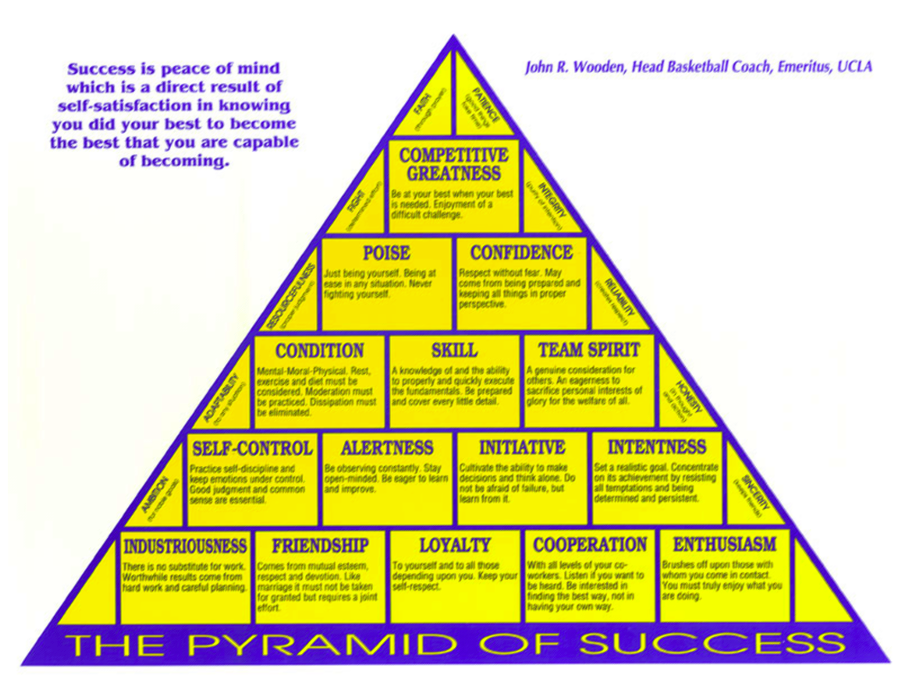

# The 5 Levels Of Leadership By John C. Maxwell

There are 5 levels of leadership:

1. Position: (rights) people follow you because they have to
2. Permission: (relationships) people follow you because they want to
3. Production: (results) people follow because of what you have done for the organization
4. People Development: (reproduction) people follow because of what you have done for them
5. Pinnacle: (respect) people follow because of who you are and what you represent

## Insights into the 5 levels of leadership

Nobody achieves anything great by giving the minimum. No teams win championships without making sacrifices and 
giving their best.

When productivity is high, chemistry is good, morale is high, and momentum is strong, then the payoffs increase.

Growing as a leader requires a combination of intentional growth and leadership experience. If you possess a 
natural gift for leadership, you probably have a passion for growth.

Leadership ability determines a person’s level of effectiveness. If you think you’re leading but no one is following,
then you are only taking a walk. The entire process includes other people and focuses on helping them.

## Level 1: Position

When a person receives a leadership position, it’s usually because someone in authority saw talent and potential
in that person.

You must use your authority you are given wisely, to advance the team and help the people you lead.

Dedicate yourself to continual development. Make the most of this opportunity in leadership by making growth your goal.

“Leadership is much less about what you do, and much more about who you are” - Frances Hesselbein

“Most obstacles that limit people’s potential are set in motion by the leader and are rooted in his or 
her own fears, ego needs, and unproductive habits.” - Captain Mike Abrashoff (It’s Your Ship book)

Successful leaders work hard to know themselves. Self-knowledge is foundational to effective leading.

When leaders don’t have and maintain strong core values, their actions impact many more people than just themselves.

According to employees’ surveys, the most important traits in a leader are:

1. 26% - leading by example
2. 19% - strong ethics or morals
3. 17% - knowledge of the business
4. 14% - fairness
5. 13% - overall intelligence and competence
6. 10% - recognition of employees

As a leader, realize the fact that all people have hopes, dreams, desires, and goals of their own.

The change from focusing on responsibilities rather than rights is a sign of maturity in a leader. 
Use your authority from your leadership position to serve others.

Good leadership is about walking beside people and helping them climb up the hill with you; it is not supposed to be 
a lonely road.

Leaders make the position, not the other way around.

It’s a fact that an organization will not function on a level higher than its leader.

It is impossible to be successful with people who give the least. You cannot buy enthusiasm…you cannot 
buy loyalty…you cannot buy the devotion of hearts, minds or souls. You must earn these.

Work higher than Level 1 by doing the following:

- Side by side - let’s work together
- Initiation - I’ll come to you
- Inclusion - what do you think?
- Cooperation - together we can win
- Servanthood - I’m here to help you
- Development - I want to add value to you
- Encouragement - I believe you can do this
- Innovation - let’s think outside the box

Good leaders stop bossing people around and start encouraging them. Good leaders don’t take anything for granted. 
They keep working and keep leading. Focus on your responsibility to make a difference in the lives of the people you lead.

“It is not the titles that honor men, but men that honor titles” - Niccolo Machiavelli

“Let him that would move the world, first move himself” - Socrates

Leave your comfort zone. Every time we leave our comfort zone and conquer new territory, it not only expands our comfort zone 
but also enlarges us.

People are the power behind any organization, they are its most valuable - and appreciable - asset.

A leader’s job is not to know everything but to attract people who know things that he or she does not. Call on your 
employees to help you find answers you don’t know. Harness the power of shared thinking.

Good leaders include others. It requires collaboration, inclusion, sacrifice of selfish personal ambition for the 
sake of the team and the vision of the organization. We are all in this together.

Guide to growing through level 1:

- Thank the people who invited you into leadership
- Dedicate yourself to leadership growth
- Define your leadership
- Shift from position to potential
- Focus on the vision
- Shift from rules to relationships
- Initiate contact with your team members
- Don’t mention your title or position
- Learn to say “I don’t know”
- Find a leadership coach

## Level 2: Permission

Building relationships breaks down organizational silos as people connect across the lines between their job descriptions or departments.

When people feel liked, cared for, included, valued, and trusted, they begin to work together with their leader and each other.

Good relationships create energy, and they give people’s interaction a positive tone.

Good leaders are open, they don’t stick to established channels of communication. They’re informal. They’re straight with people. They make a religion out of being accessible.

The road to vision buy-in is two-way communication.

Listen to others and give to others:

- Ears - I hear what you say
- Eyes - I see what you say
- Heart - I feel what you say
- Undivided attention - I value who you are and what you say

When you create better communication, you also build a community. A community is a place in which people know and care for one another.

When there is danger, a good leader takes the front line. But when there is celebration, a good leader stays in the back room.

In times of difficulty, relationships are a shelter. IN times of opportunity, they are a launching pad. Trust is required for people to feel safe enough to create, share, question, attempt, and risk. Building relationships takes time. It can be very slow work.

As a leader, the goal is to help people, not make them happy. The primary goal of leadership: helping others work together, move forward, and achieve.

“The most essential quality for leadership is not perfection but credibility. People must be able to trust you” - Rick Warren

Develop authentic relationships, not fake ones. Be the real deal. How can we become more likable?

- Make a choice to care about others
- Look for something that is likable about every person you meet
- Discover what is likable about yourself and share it with every person you meet
- Make the effort every day to express what you like about every person in your life

It’s important to remember that while the things we have in common may make relationships enjoyable, the differences are what really make them interesting.

Good leaders are able to look at hard truths, see people’s flaws, face reality, and do it in a spirit of grace and truth. They don’t avoid problems; they solve them.

To be a good leader, have self-awareness. Once you know yourself, forget about yourself and place your focus on others. You will relate to other people from a place of strength.

Get along with yourself, improve your self-image. There are a lot of things you can change about yourself. Work hard at those. But there are also many you can’t. Accept them.

“In matters of conscience, stand like a rock; in matters of fashion, go with the flow” - Thomas Jefferson

Be true to yourself, self-honesty.

Always continue improving yourself, self-improvement.

Take responsibility, self-responsibility.

You must exhibit a consistent mood, maintain an optimistic attitude, possess a listening ear, and present to others your authentic self.

Practicing the golden rule enables everyone to feel respected.

“Kind words can be short and easy to speak, but their echoes are endless” - Mother Teresa

People enjoy affirmation from a peer. But they really value it from their leader. If you become the chief encourager of the people on your team, they will work hard and strive to meet your positive expectations.

Strike a balance between care and candor. Hire people for what they know and fire them for who they are.

Caring values the person while candor values the person’s potential.

Caring establishes the relationships while candor expands the relationship.

Caring defines the relationships while candor directs the relationships. Getting the team moving together to accomplish a goal is the responsibility of the leader, and often requires candor.

“Good leadership involves responsibility to the welfare of the group, which means that some people will get angry at your actions and decisions. It’s inevitable - if you’re honorable” - Colin Powell

Caring should never suppress candor, while candor should never displace caring. Before you have a candid conversation with someone, make sure you answer yes to the following questions:

- Have I invested enough in the relationships to be candid with them?
- Do I truly value them as people?
- Am I sure this is their issue and not mine?
- Am I sure I’m not speaking up because I feel threatened?
- Is the issue more important than the relationship?
- Does this conversation clearly serve their interests and not just mine?
- Am I willing to invest time and energy to help them change?
- Am I willing to show them how to do something, not just say what’s wrong?
- Am I willing and able to set clear, specific expectations?

Follow these guidelines when having a candid conversation:

- Do it quickly, while it’s small
- Do it calmly, never in anger
- Do it privately
- Do it thoughtfully, minimize embarrassment or intimidation

You must allow the people you work with to be candid with you. You must solicit feedback. And you must be mature and secure enough to take in people’s criticism without defensiveness and learn from it.

The influencing process begins at level 2, where relationships are formed. That is where leadership begins the shift from coercion to cooperation.

Trust is the foundation of leadership.

Who you are is who you attract, like-minded people are attracted to one another.

Leaders touch a heart before they ask for a hand.

People buy into the leader, then the vision. You must earn their trust and gain permission to lead them.

If you want to do big things, you need to take people out of their comfort zone. If you risk and win, then your people gain confidence. If you risk and fail, you lose relational credibility with your people and you will have to rebuild the relationships.

“If people relate to the company they work for, if they form an emotional tie to it and buy into its dreams, they will pour their heart into making it better.” - Howard Schultz

Guide to growing through level 2:

- Have the right attitude toward people. Make people a priority
- Connect with yourself:
  - Self-awareness
  - Self-image
  - Self-honesty
  - Self-improvement
  - Self-responsibility
- Understand where you’re coming from
- Express value for each person on your team
- Evaluate where you are with your team
- Accept the whole person
- Make fun a goal
- Give people your undivided attention
- Become your team’s encourager in chief
- Practice care and candor, practice the golden rule

## Level 3: Production

Good leaders are able to help the team produce. This ability gives level 3 leaders confidence, credibility, and increased influence.

Level 3 leaders set up their own quotas and constantly exceed them. They are self-motivated and productive. As a result, they create momentum and develop an environment of success, which makes the team better and stronger.

Authentic leaders know the way and show the way to productivity. Their leadership talk is supported by their walk. They deliver results. They live on their performance, not their potential. They lead by example. And their ability to get results tends to silence their critics and build their reputations.

Level 3 leader can be summed up in one word: example. Productive leaders are an example to the people they lead, and their productivity sets the standard for the team. Productivity puts people at the head of the class.

Be the man who delivers the goods.

The production level of leadership communicates the vision through action.

“If you should need help again, call on Washington, your commander in chief, and I will come.” - George Washington

People who feel good about themselves often produce good results. And good results create positive momentum and high morale. Keep producing, and high morale will continue for a long time.

Leadership production creates momentum. Spend less time trying to fix problems and more trying to create momentum.

Focus on momentum makers, not takers. Momentum makers make things happen. If you build solid permissional relationships on top of a foundation of positional rights and add the results of productivity, you will gain momentum.

People simply love being on a winning team.

Leadership is defined by what a person does with and for others. It is established by making the team better and more productive. Possess the desire to take the entire team to a higher level of production.

Productive leaders feel a heavy weight of responsibility for results. High performance requires high commitment. Effective leaders understand the cost of leadership is carrying the responsibility of their team’s success on their shoulders.

“Be willing to make decisions. That’s the most important quality in a good leader.” - T. Boone Pickens

Most of the decisions needed to be made are related to yourself! About 25% are decisions related to the team, the rest are personal ones that require change, honesty and self-discipline.

Make difficult decisions to:

- Be successful before you try to help others be successful
- Hold yourself to a higher standard than you ask of others
- Make yourself accountable to others
- Set tangible goals and then reach them
- Accept responsibility for personal results
- Admit failure and mistakes quickly and humbly
- Ask from others only what you have previously asked of yourself
- Gauge your success on results, not intentions
- Remove yourself from situations where you are ineffective

Going first may not always be easy or fun, but it is always a requirement of a leader. It paves the way for the people who follow and increases their chance of success for completing the journey.

Keep developing the relationships and caring for them as you produce results.

Understand how your personal giftedness contributes to the vision.After you discover your personal giftedness, begin to focus your efforts. Productivity has to start with the leader.

Help people define the success of the vision. Define or redefine what success means for the people you lead.

Help people commit to the success of the vision.

Help people experience success. Give them the credit they deserve.

Develop a good team, since a good team is always greater than the sum of its parts and is able to accomplish more than individuals working alone.

Team members should complement one another, team leaders should make this happen.

“The job of a leader is to build a complementary team, where every strength is made effective and each weakness is made irrelevant.” - Stephen Covey

It takes all the players to help one player make a basket. And it takes a leader to help them figure out how to do it and lead them through the process.

Applicable laws of teamwork:

- Law of significance: one is too small a number to achieve greatness
- Law of Mount Everest: as the challenge escalates, the need for teamwork elevates
- Law of the catalyst: winning teams have players who make things happen
- Law of the bench: great teams have great depth
- Law of dividends: investing in the team compounds over time

Team members should understand their mission, team leaders should make this happen. Don’t take for granted that they know what you know or believe what you believe. Don’t assume they understand how their talents and efforts are supposed to contribute to the mission of the team. Communicate it often.

Applicable laws of teamwork:

- Law of the big picture: the goal is more important than the role
- Law of the niche: all players have a place where they add the most value
- Law of the compass: vision gives team members direction and confidence
- Law of the price tag: the team fails to reach its potential when it fails to pay the price

Team members should receive feedback about their performance, leaders should make this happen.

Provide feedback in 3 realms:

- Did right
- Did wrong
- Will change

People always want to know how they’re doing. They want to succeed. And if they’re not succeeding, most of the time they want to know how to make adjustments to improve. Convince your team that changing will help them win.

Applicable laws of teamwork:

- Law of the chain: strength of the team is impacted by its weakest link
- Law of the bad apple: rotten attitude ruins a team
- Law of countability: count on each other when it counts
- Law of the scoreboard: make adjustments when it knows where it stands

Team members should work in an environment conducive to growth and inspiration, make it your goal to lift up others and help them do their best.

A little more praise than is their due, and confess more fault than you justly be charged with to become a greater captain.

Attitude is contagious. If they are positive, encouraging, and open to growth, so are their people. Acknowledge the influence you have and use it to everyone’s best advantage.

Applicable laws of teamwork:

- Law of identity: shared values define the team
- Law of communication: interaction fuels action
- Law of the edge: difference between two equally talented teams is leadership
- Law of high morale: when you’re winning, nothing hurts

Prioritize the things that yield high return. Staying in your areas of strength - where your efforts yield the highest return - and out of your areas of weakness is one of the keys to personal productivity. Use the Paretto rule (80/20) and understand what 20% gives your 80% yield by asking these questions:

- What is required of me? (what I must do)
- What gives me the greatest return? (what I should do)
- What is most rewarding to me? (what I love to do)

Your goal should be to help every person get to the place where they are doing their should-dos and love-to-dos, because that is where they will be most effective.

Be a change agent. It’s very difficult to make changes when an org is standing still. Get it going in any direction and you will find it easier to make changes to move it in the right direction. Momentum provides the energy for needed change.

To move faster, find common ground, focus on the similarities and build upon those. Look for common ground in the following areas:

- Vision
- Values
- Relationships
- Attitude
- Communication: inform everyone so that everyone is on the same page

Remain focused and productive, all while cultivating and preserving positive relationships.

The law of respect: people naturally follow leaders stronger than themselves.

The law of magnetism: who you are is who you attract.

The law of the picture: people do what people see.

The law of victory: leaders find a way for the team to win.

The law of the big momentum: leader’s best friend. Good results create momentum. Never take momentum for granted. Keep giving your all.

The law of priorities: leaders understand that activity is not necessarily accomplishment. Do the right things the right way at the right time for the right reasons.

The law of sacrifice: a leader must give up to go up. You’ll have to give up doing some of the things you love that don’t give a great enough return on your time.

“You can tell you’re on the road to success; it’s uphill all the way.” - Paul Harvey

The law of buy-in: people buy into the leader then the vision. They want to know you care about them, and they want to know you can produce.

Great leaders measure themselves by what they get done through others. That requires developing people in a leadership culture. Seek the higher levels where you can help change people’s lives.

People are an org’s most appreciable asset. Start thinking in terms of how you can help the individuals on your team to improve themselves and tap into their potential.

Every time you increase the ability of a person in the org, you increase the ability to fulfill the vision. The more leaders an org has, the greater its horsepower.

If you help ppl become bigger and better on the inside, eventually they will become greater on the outside.

Guide to growing through level 3:

- Be the team member you want on your team
- Translate personal productivity into leadership
- Understand everyone’s productivity niche
- Cast vision continually
- Build your team. Do not penalize risk taking. Praise people’s effort, help them learn from their failures, and reward their successes.
- Use momentum to solve problems
- Discern how team members affect momentum
- Focus on momentum makers, not takers or breakers
- Practice the Pareto principle
- Accept your role as a change agent
- Don’t neglect level 2 (relationships)

Level 4: People Development
Good leaders on level 4 invest their time, energy, money and thinking into growing others as leaders. Every person is a potential candidate for development.

Making the right ppl decisions is the ultimate means of controlling an org well. Ppl decisions cannot be hidden. Don’t try. Put only 20% of focus on personal productivity and 80% on developing and leading others.

Ppl development sets you apart from most leaders. Ppl need to have the conviction that there is value in their dreams. When current or would-be leaders realize that you are investing in their growth, it’s more important to them than money.

“When you look at ppl who are eager to learn more, you can bet they are on the right track.” - Jim Blanchard

Anybody can replicate physical capital, but the one resource nobody can replicate is the dedication, the teamwork, the skills of a company’s employees.

Ppl development assures that growth can be sustained.

Leadership paradigm:
Leaders transfer ownership for work to those who execute the work
Leaders create the environment for ownership where each person wants to be responsible
Leaders coach the development of personal capabilities
Leaders learn fast themselves and encourage others also to learn quickly

Don’t be the lid on your org.

Ppl development empowers others to fulfill their leadership responsibilities. Many things can only be learned through experience. Give someone responsibility and authority, they will learn and fulfill their leadership responsibilities.

No leader is self-made. Our gift back is to take responsibility and do our best to lead others with effectiveness and integrity.

It’s important that employees make decisions that most directly affect them. That’s how the best decisions are made. That's the essence of empowerment.

When you develop others to become leaders, you actually get back time from the shared responsibilities.

You must move from perfectionist to pragmatist to become an effective leader.

“The purpose of life is not to win. The purpose of life is to grow and to share.” - Rabbi Harold Kushner

Ppl development requires a very high maturity level. When you become a leader you give up the right to think about yourself. The leader is the servant who removes the obstacles that prevent people from doing their jobs. If you help others to get what they want, they will help you get what you want.

Insecurity can make leaders feel threatened by ppl development. However, winning is a collaborative effort. Get your ppl thinking more highly of themselves. Shortsightedness, like selfishness and insecurity, is another sign of immaturity in a leader. Ppl development requires big-picture thinking. It takes patience.

Good leaders forge ahead, break ground and make mistakes. Leaders are pioneers - ppl who are willing to step out into the unknown.

Try to help your ppl make the most of their fumbles, flops and failures. Guide, energize and excite. That’s what level 4 leaders do.

Most leaders are not willing to put forth the tremendous effort it takes and to make the sacrifices needed to do it. Figure out how to do the job with the highest level of excellence, recruit a team, develop them, model leadership, find a potential successor, train and develop that person, and empower him or her to lead in their place.

Will you lose your job by developing others or will you lose it because you didn’t develop others? It’s always the leader’s choice.

It takes a leader to KNOW a leader (recruiting and positioning).

It takes a leader to SHOW a leader (modeling and equipping).

It takes a leader to GROW a leader (developing, empowering and measuring).

### Recruiting - find the best people possible

The people you recruit must possess natural ability in the area where they are to be developed, exhibit the desire to grow, and be a good fit for the org.

When looking for potential leaders, use the 4 Cs:

- Chemistry: if you don’t like a person, you will not be an effective mentor to them
- Character: good character makes trust possible
  - Character is what closes the gap between knowing and doing
  - “Good people are found, not changed” - Jim Rohn
- Capacity
  - Stress management: ability to withstand and overcome pressure, failure, deadlines and obstacles
  - Skill: ability to get specific tasks done
  - Thinking: ability to be creative, develop strategy, solve problems and adapt
  - Leadership: ability to gather followers and build a team
  - Attitude: ability to remain positive and tenacious amid negative circumstances
- Contribution: some ppl possess the X factor, they are winners
  - Winners contribute beyond their job responsibilities, and they lift the performance of everyone on their team

### Positioning - placing the right people in the right position

Positioning ppl correctly is a process, sometimes it means trying and failing. As a leader, you have to take it all in stride.

### Modeling - showing others how to lead

“I could not ask him to stop eating sweets so long as I had not stopped eating sweets.” - Mahatma Gandhi

Model with integrity in order to help ppl to develop on level 4:

- Authenticity: foundation for developing ppl
- Servanthood: soul for developing ppl
- Growth: measurement for developing ppl
- Excellence: standard for developing ppl
- Passion: fuel for developing ppl
- Success: purpose for developing ppl

### Equipping - helping others do their jobs well

Five steps process to equip others:

1. I do it (competence)
2. I do it and you are with me (demonstration)
3. You do it and I am with you (coaching)
4. You do it (empowerment)
5. You do it and someone is with you (reproduction)

### Developing - teaching them to do life well

3 key elements drive leadership development in others:

1. Assessment: continually be on the lookout for holes in the life skills of someone you are leading and developing
2. Challenge: they accept a challenge from you to improve
3. Support: nobody is self-made

### Empowering - enabling people to succeed

As you release tasks to the leaders you’re developing, you need to trust them, believe in them and hold them accountable. Without accountability, ppl drift. With it they achieve results.

### Measuring - evaluating those whom you develop to maximize their efforts

There are different degrees of ability when it comes to empowerment, here are 6, from least independent to most:

1. Look into it. Report. I’ll decide what to do.
2. Look into it. Report alternatives w/pros and cons and your recommendation.
3. Look into it. Let me know what you intend to do, but don’t do it unless I say yes.
4. Look into it. Let me know what you intend to do and do it unless I say no.
5. Take action. Let me know what you did.
6. Take action. No further contact required.

### The laws of leadership at the ppl development level

The law of addition: leaders add value by serving others

- Mentoring is not a race. Few pursue success for their people.

The law of the inner circle: a leader’s potential is determined by those closest to him

- If you are a leader with a big vision, you won’t be able to achieve it without a team of leaders - an inner circle.

The law of empowerment: only secure leaders give power to others

The law of explosive growth: to add growth, lead followers, to multiply, lead leaders

The law of buy-in: ppl buy into leaders then the vision

- Ppl go beyond just knowing the vision, they feel the vision.

### Beliefs that help a leader move up to level 5

The highest goal of leadership is to develop leaders, not gain followers or do work.

When you help other ppl become leaders, you change their lives.

If they become good leaders, you help them improve not only their lives, but also the lives of everyone they touch. I believe that is how you change the world for the better. As a leader 4, focus 80% of your attention on developing the best 20%of the leaders you have.

To develop leaders, you must create a leadership culture.

Create a growth-oriented company where ppl know the biggest thing to grow is them.

Do the following to create a leadership culture:

- Champion leadership: define and model good leadership
- Teach leadership: train leaders
- Practice leadership: help emerging leaders
- Coach leadership: provide feedback
- Reward leadership: pay, give resources and recognition

Developing leaders is a life commitment, not a job commitment.

Level 5 leaders consistently develop leaders over a lifetime, and the leaders they raise up also develop leaders. It becomes a lifestyle they practice worthy of a lifetime commitment.

### Guide to growing through level 4

Be willing to keep growing yourself.

Maintain a teachable spirit, which says, everyone can teach me something. Everything can teach me something.

Keep yourself on a growth plan.

Decide that ppl are worth the effort.

Work through your insecurities.

Recruit the best ppl you can develop.

- Most leaders spend their time and energy on the wrong ppl: the bottom 20%. Level 4 leaders focus their best time and energy on the top 20%, the ppl who don’t need attention but would most profit from it.

Commit to spend the time needed to develop leaders

- First, build a support system to free yourself up. Second, determine the amount of time you give someone based on his or her potential.

Create a personal development process

The ability to see, discern and analyze is essential to developing ppl. Level 4 leaders lead everyone differently, that takes creativity and confidence. Level 4 leaders also bring structure and stability to the development process by following the guidelines:

- The process must occur daily
- The process must be measurable, although growth begins inwardly, it must be proven outwardly
- The process must include things they value
- The process must align with your strengths
- The process must fit into their dream plan

Never work alone.

- Model leadership, give them responsibilities that you can monitor. Empower them to act on their own.

Blend the soft and hard sides of development.

- Deal simultaneously with ppl issues and business issues.

Take responsibility for energizing others.

- Create energy and inspire others to achieve.

Remain approachable as a leader, role model and coach.

- An open door and open heart invite ppl to come into a leader’s life. Openness, humility and transparency are always very attractive.

## Level 5: the pinnacle (respect) - ppl follow you because of who you are and what you represent

Level 5 leaders often possess an influence that transcends the org and the industry the leader works in.

The pinnacle level is not a resting place, it is a reproducing place to lift up as many leaders as you can, tackle as many great challenges as possible and extend your influence to make a positive difference beyond your own org and industry.

### The upside of the pinnacle

Pinnacle leadership creates a level 5 org:

- Make your org adapt leadership as part of its DNA. Level 5 orgs have a pipeline of leaders being produced.

Pinnacle leadership creates a legacy within the org.

Pinnacle leadership provides an extended platform for leading.

You have to earn the right to be heard. As a level 5 leader, your influence extends beyonds you reach. Leaders have a chance to make a broader impact on society or to advance the cause of leadership. With this extended influence comes a responsibility to steward it with integrity, to serve others and to give to others.

“Strange is our situation here upon earth. I must exert myself in order to give in return as much as I have received.” - Albert Einstein

Learn, earn, return. Lear all you can and keep learning. Don’t lead others solely for your own benefit.

Leaders who dedicate themselves to developing more leaders and pour themselves into the task, giving their best energies and resources to raise up other leaders, are the only ones who have the chance to move up to the pinnacle.

The downside of the pinnacle: 

- No matter how good they’ve been in the past, they still need to strategize, weigh decisions, plan and execute at a high level.

To be effective, leaders must always be learners. You can never arrive, you can only strive to get better.

Being on the pinnacle can lead you to believe your own press.

History is full of stories of ppl who got carried away with their power and position. Be confident, but also be humble. If you’ve become successful, it’s only because a lot of other ppl helped you all along the way.

Being on the pinnacle can make you lose focus.

Must remain focused on your vision and purpose and continue leading at the highest level.

Never forget that what got you to where you are won’t get you to the next level. Each step forward requires focus and willingness to keep learning, adapting, strategizing and working. You don’t stay on top without focus, humility and hard work.

### Best behaviors on level 5

Make room for others at the top.

When you develop a leader who develops other leaders, you create more room at the top because you increase the size and power of the entire org.

The leader’s desire - being succeeded instead of needed.

The leader’s focus - working on ppl’s strengths instead of weaknesses.

If you want to develop ppl, you must help them discover and build upon their strengths.

The leader’s attitude - giving away power instead of hoarding it.

“The empowerment leadership model shifts away from position power to people power where all ppl are given leadership roles so they can contribute to their fullest capacity.” - Lynne Joy McFarland

The leader’s perspective - seeing potential leaders as they could be instead of as they are.

Seeing what could be - and helping to make it reality - takes vision, imagination, skill and commitment.

The leader’s impact - knowing it takes a level 5 leader to develop a level 4 leader.

The best potential leaders will not remain in the org unless you go to them where they are, extend your hand, and help them to climb up to your level.

Continually mentor potential level 5 leaders.

Make it to the pinnacle, give your best potential leaders your best and never stop mentoring them.

Create an inner circle that will keep you grounded.

A good inner circle will allow leaders to be themselves, but inner circle members will also tell them the truth about themselves.

Do things for the org that only level 5 leaders can do.

You need to be a good model to everyone in the org by valuing ppl, continuing to grow, practicing the golden rule, being authentic, exhibiting good values, and living out the right priorities. Leadership is influence. Leverage it to add value to others.

Plan for your succession.

True leaders put ego aside and strive to create successors who go beyond them. Plan to hand off the baton of leadership in stride when they are still running at their peak. No leader should hurt the org’s momentum by staying too long for his or her own gratification.

Leave a positive legacy.

“The most surprising thing about life is the brevity of it.” - Billy Graham

Recognize what you do daily, over time that becomes your legacy. Then decide now what you want your legacy to be. Finally, understand that a legacy is the sum of your whole life, not just snippets. Fulfill your mission and vision for your life. Do it now before it is too late to change.

### The laws of leadership at the pinnacle level

The law of respect: ppl naturally follow leaders stronger than themselves.

The law of timing: when to lead is as important as what to do and where to go.

Intuition doesn’t carry as much weight - unless you have a proven track record of right assessments to back it up. Listen to your intuition, take note of when it’s wrong or right, and develop a track record that will bring you the credibility you desire.

The law of legacy: a leader’s lasting value is measured by succession.

Invest what you have in the lives of others.

### Experienced-based leader development

Identify and create the crucial leadership lessons they must learn

Good qualities:

- Integrity
- Vision
- Influence
- Passion
- Servanthood
- Confidence
- Problem-solving
- Communication
- Creativity
- Teamwork
- Attitude
- Self-discipline

Look for experienced-based lessons in those areas above. Ask them what they’ve learned from it. All of us experience far more than we understand. Your job is to help the high level ppl to make sense out of what they experience and find value in it.

Use your own crucible moments as guidelines to teach others.

Categories to use when analyzing leadership crucible experiences:

- Ground breakers - encourage ppl to start develop a leadership quality or discipline
- Ice breakers - help leaders move forward after a period of stagnation
- Cloud breakers - give insight into a world larger than own limited experience
- Tie breakers - allow ppl to make a decision that will determine their leadership direction
- Heart breakers - cause leaders to stop and evaluate where they are and what they are doing
- Record breakers - allow leaders to break through their leadership lids

The purpose of reflecting on and listing your leadership breakthroughs is to share them with other potential leaders.

Some ppl will call you arrogant or egocentric when you tell them. Don’t let them deter you.

There’s no telling what kind of an impact you’ll have or how long that impact will last as a level 5 leader.

### Guide to being your best at level 5

Remain humble and teachable:

- Write a credo for learning that you will follow every day
- Find one or more ppl who are ahead of you in leadership
- Dedicate yourself to a hobby, task or physical activity

Maintain your core focus.

Identify that core strength and write out a plan for making the most of it in the coming years.

Create the right inner circle to keep you grounded.

Ask them the following:

- Love me unconditionally
- Represent me according to my values
- Watch my back
- Complement my weaknesses
- Continue to grow
- Fulfill their responsibilities with excellence
- Be honest with me
- Tell me what I need to hear, not what I want to hear
- Help carry the weight, not be an extra weight
- Work together as a team
- Add value to me
- Enjoy the journey with me

I give them my loyalty, love, and protection; I reward them financially; I develop them in leadership; I give them opportunities; and I share my blessings.

Do what only you can do.

Create a supercharged leadership development environment.

Create room at the top.

Develop your top leaders.

Plan your succession.

Plan your legacy.

Identify it while you’re still able to affect it, and start doing whatever you must try to fulfill your legacy.
Use your leadership success as a platform for something greater.

Player development method:

1. Explanation - tell them what you want them to know and do
2. Demonstration - show them what you want them to know and do
3. Initiation - let them show you that they know what to do
4. Correction - ask them to change what they are doing incorrectly
5. Repetition - ask them to do it right over and over again

Level 5 leaders usually have other leaders say, “I want to live and die like he did”.

