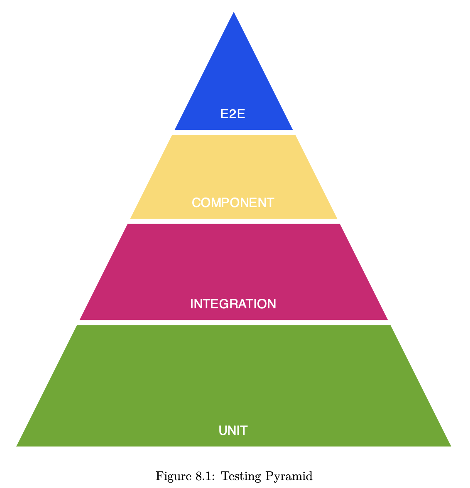

# Go with Domain

By Three Dots Lab

## Acronyms and Introduction

DDD: Domain Driven Design

SOLID:

- Single responsibility principle
- Open/closed principle
- Liskov substitution principle
- Interface segregation
- Dependency inversion principle

“The alternative to good design is always bad design. There is no such thing as no design.”
- Adam Judge

It’s worth discussing architecture decisions before you stumble on issues. “No architecture” will just leave you with bad architecture.

**Domain-driven design (DDD)** is the concept that the structure and language of your code (class names,
class methods, class variables) should match the **business domain**.

Coding is a war, to win you need a strategy!

Strategic DDD patterns is a set of patterns that helps us bridge the gap between the solution created  and the business problem.

Do Event Storming, a technique to discuss with stakeholders all angles of the product and/or service.

## Reflect Your Business Logic

The First Rule - reflect your business logic literally.

You should instead think about them like types with behavior.

## Keep a Valid State in Memory

The Second Rule: always keep a valid state in the memory.

Rugged Software: describes software development organizations that have a culture of rapidly evolving their ability to create available, survivable, defensible, secure, and resilient software. (Ref: https://ruggedsoftware.org/)

Our goal is to do validation in only one place (good DRY) and ensure that nobody can change the internal state of an object/struct. The only public API of the object should be methods describing behaviors.

We need to also put our types to separate package and make all attributes private.

## Domain Needs to be Database Agnostic

The Third Rule - domain needs to be database agnostic. Keeping the domain strictly without any database influence works best.

The most important reasons are:

- Domain types are not shaped by used database solution – they should only be shaped by business rules
- Store data in database in a more optimal way

## The Repository Pattern

Keeping logic of your application along with your database logic makes your application much more complex, hard to test, and maintain.

The **repository pattern** allows you to separate your application logic from database logic. It allows you to make your code simpler and easier to add new functionalities.

As a bonus, you can defer important decision of choosing database solution and schema.

Another good side effect of this approach is immunity for database vendor lock-in.

### Repository Interface

Let’s abstract our database implementation by defining interaction with it by the interface. You need to be able to use this interface for any database implementation – that means that it should be free of any implementation details of any database.

When we use the Domain-First approach, the first and simplest repository implementation may be in-memory implementation.

Deferring the decision about the database for later can save some time at the beginning of the project. With more information and context, we can also make a better decision for database vendor.

It’s better to entirely separate domain types from the database. Some advantages are:

- It’s easier to test
- We don’t duplicate validation
- It does not introduce a lot of boilerplate

### Updating the Data

[**Optimistic concurrency control**](https://en.wikipedia.org/wiki/Optimistic_concurrency_control) assumes that many transactions can frequently complete without interfering with each other.

The biggest challenge now is "how to manage transactions in a clean way that does not affect the rest of the application too much, is not dependent on the implementation, and is explicit and fast?"

There are many options, but favorite is **an approach based on closure passed to the function**. Advantages of using this approach:

- Get and provide all parameters for passed in function
- Execute the closure
- Save return values (or return more)
- Execute a rollback in case of an error returned from the closure

## High-Quality Database Integration Tests

To develop your application easily and with confidence, you need to have a set of tests on multiple levels.

Basic Go testing techniques:

- Test tables
- Assert functions
- Parallel execution
- Black-box testing

When big part of our application is connected to some infrastructure (for example: database) it’s just hard to cover a lot of functionality with unit tests.

### 4 Principles of High-Quality Tests

1. Speed: good tests need to be fast
2. Testing enough scenarios on all levels
3. Tests need to be robust and deterministic
4. Be able to execute most of the tests locally

### Implementation

The way how we can interact with our database is defined by the `Repository` interface. It assumes that our repository implementation is stupid. All complex logic is handled by the domain part of our application. 

Our `Repository` should just save the data without any validations, etc. 

One of the significant advantages of that approach is the simplification of the repository and tests implementation.

It's always a good idea to build all non-unit tests to be able to work in parallel, so your tests will be always fast and you will not be afraid to add more tests because of
↪ slowdown, `t.Parallel()`.

There is a popular github.com/stretchr/testify library. It significantly reduces boilerplate in tests by providing multiple helpers for asserts.

If asserts fail, test executions are not interrupted. However, asserts from the `require` pkg are used, then it does fail and interrupts tests.

When we assert multiple values, assert is a better choice, because you will receive more context.

If we have more specific data to assert, it’s always a good idea to add some helpers. It removes a lot of duplication, and improves tests readability a lot.

## Clean Architecture

“Low coupling, high cohesion” concept, the main benefit of clean architecture.

A big part of it is abstracting away implementation details, a standard in technology, especially software. Another name for it is separation of concerns.

Our approach to Clean Architecture is two ideas combined:

1. Separating Ports and Adapters
2. Limiting how code structures refer to each other

